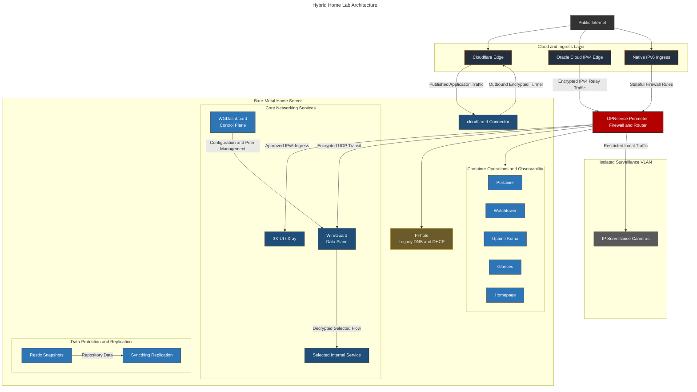

# Hybrid Home Lab Infrastructure & Security Architecture

A documented, multi-node home lab built around dual-stack networking, IPv4 CGNAT mitigation, network segmentation, containerized services, and hybrid cloud connectivity.

This repository covers the architecture, configuration, security decisions, and incident analysis for services deployed across on-premises hardware and public cloud infrastructure.

---

## Core Engineering Objectives

* **Dual-Stack Ingress and CGNAT Mitigation:**
  * **IPv4 Strategy:** Outbound Cloudflare tunnels and an Oracle Cloud edge node provide access to selected services without relying on inbound IPv4 port forwarding.
  * **IPv6 Strategy:** Native IPv6 connectivity supports direct ingress through narrowly scoped, stateful OPNsense firewall rules.
* **Network Segmentation:** Dedicated network segments separate infrastructure, trusted clients, and untrusted IoT devices. Surveillance devices are restricted to approved local traffic.
* **Container Lifecycle Management:** Docker Compose and Portainer provide declarative service deployment and centralized container administration, with Watchtower handling automated image polling and updates.
* **Infrastructure Observability:** Uptime Kuma and Glances provide service availability checks and host-level resource monitoring.
* **Secure Remote Connectivity:** Xray and WireGuard provide encrypted access paths for remote clients and site-to-site connectivity.

---

## Hardware Platform

| Component | Specification | Role |
| --- | --- | --- |
| Home Server | Intel Core i7-4790, 4 cores / 8 threads, 8 GB RAM, 120 GB SSD, 500 GB HDD, 1 TB HDD, 1 GbE | Container host, monitoring, synchronization, and internal services |
| OPNsense Appliance | Dedicated network appliance | Routing, firewall enforcement, VLAN segmentation, DNS, DHCP, and IPv6 policy |
| Oracle Cloud VPS | Public cloud instance | IPv4 edge node and tunnel endpoint for CGNAT mitigation |

Hardware identifiers, network addresses, interface assignments, and public endpoints are intentionally excluded.

---

## Architecture Topology



---

## Implemented Services and System Documentation

### 1. Network Perimeter and Edge Defense

* **[OPNsense](services/opnsense.md) (WIP):** Primary edge router responsible for VLAN segmentation, stateful IPv4 and IPv6 firewall policy, prefix delegation, DNS, DHCP, and internal routing.
* **[Pi-hole](services/pi-hole.md):** Previous DNS sinkhole and DHCP service, retained as a documented migration and troubleshooting case study.
* **[3X-UI (Xray / VLESS)](services/3x-ui.md):** Management platform for encrypted Xray proxy services exposed through controlled ingress paths.

### 2. Hybrid Cloud and Remote Ingress

* **[Oracle Cloud Instance](services/oracle.md):** Public IPv4 edge node used to anchor encrypted connectivity and bypass residential CGNAT limitations.
* **[Cloudflare Tunnel](services/cloudflare-tunnel.md):** Outbound tunnel connector providing access to selected internal web services without opening inbound IPv4 ports.
* **[WGDashboard](services/wgdashboard.md):** Management interface for WireGuard client and site-to-site tunnel configurations.

### 3. Container Operations and Observability

* **[Portainer](services/portainer.md):** Centralized Docker management for service deployment and stack administration.
* **[Watchtower](services/watchtower.md):** Automated container image polling and update management.
* **[Uptime Kuma](services/uptime-kuma.md):** Docker workload and TCP listener monitoring with email alerting and scheduled maintenance handling.
* **[Glances](services/glances.md):** Host and container telemetry for CPU, memory, storage, network, and process utilization.
* **[Homepage](services/homepage.md):** Unified internal dashboard for service access and status information.

### 4. Data Synchronization and Isolated Workloads

* **[Surveillance Cameras](services/surveillance.md) (WIP):** IP camera infrastructure isolated on a dedicated VLAN with restricted network access.
* **[Syncthing](services/syncthing.md):** Encrypted peer-to-peer replication for protected folder copies and redundant Restic repository storage.

---

## Repository Structure

```text
.
├── README.md
└── services/
    ├── assets/
    │   └── screenshots/
    │       ├── 3x-ui-public.png
    │       ├── glances-public.png
    │       └── pi-hole-public.png
    ├── 3x-ui.md
    ├── cloudflare-tunnel.md
    ├── glances.md
    ├── homepage.md
    ├── opnsense.md
    ├── oracle.md
    ├── pi-hole.md
    ├── portainer.md
    ├── surveillance.md
    ├── syncthing.md
    ├── uptime-kuma.md
    ├── watchtower.md
    └── wgdashboard.md
```

Each service document follows a common structure:

1. **Overview and Purpose**
2. **Deployment Architecture**
3. **Security Rationale and Trade-offs**
4. **Failure Modes and Resolution**
5. **Incident Post-Mortems, where available**

---

> [!NOTE]
> **Repository Status:** This repository is maintained alongside the lab and updated when architecture, configuration, or recovery procedures change. OPNsense and surveillance documentation remain marked as work in progress.
