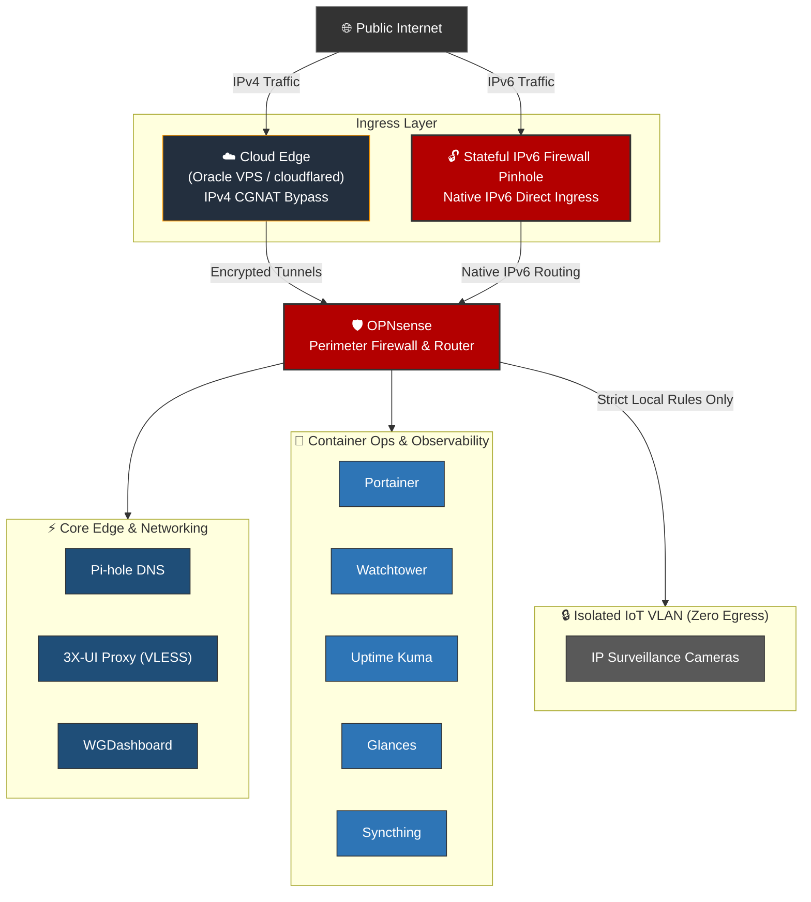

# Production Home Lab Architecture & Zero-Trust Infrastructure

A documented, multi-node hybrid home lab environment designed around **Dual-Stack Network Architecture**, CGNAT bypass strategies, automated infrastructure lifecycle management, and strict micro-segmentation. 

This repository details the configuration, operational rationale, security trade-offs, and troubleshooting post-mortems for each core service running across on-premises bare metal and public cloud infrastructure.

---

## Core Engineering Objectives

* **Dual-Stack Ingress & CGNAT Mitigation:**
  * **IPv4 Strategy:** Bypasses Carrier-Grade NAT (CGNAT) without open IPv4 WAN ports using outbound Zero-Trust overlay tunnels (`cloudflared` daemons and Oracle Cloud VPS endpoints).
  * **IPv6 Strategy:** Leverages native IPv6 Global Unicast Addresses (GUA) for direct edge ingress, controlled strictly via stateful OPNsense IPv6 firewall pinholes.
* **Micro-Segmentation & Zero Egress:** Untrusted IoT infrastructure (e.g., IP surveillance cameras) is isolated on dedicated VLANs with zero outbound internet access.
* **Automated Lifecycle Management:** Implemented automated image polling and container updating (`Watchtower`) to minimize vulnerability exposure windows.
* **Telemetry & Infrastructure Observability:** Centralized health checking and resource metric tracking to identify performance bottlenecks and anomalous container behavior.

---

## Architecture Topology


---

## Implemented Services & System Documentation

### 1. Network Perimeter & Edge Defense

* **[OPNsense](/services/opnsense.md):** Primary edge router enforcing VLAN micro-segmentation, stateful IPv4/IPv6 firewall rules, dynamic prefix delegation, and local routing logic.
* **[Pi-hole](/services/pi-hole.md):** Internal recursive DNS resolver and sinkhole utilized for egress telemetry filtering, ad-network blocking, and local DNS management.
* **[3X-UI (Xray / VLESS)](/services/3x-ui.md):** Encrypted proxy panel providing obfuscated VLESS traffic encapsulation. Accessible externally via direct IPv6 pinholing on OPNsense, bypassing IPv4 CGNAT constraints.

### 2. Hybrid Cloud & Zero-Trust Ingress

* **[Oracle Cloud Instance](/services/oracle.md):** Public cloud VPS serving as an IPv4 edge node to anchor reverse-proxy tunnels and offload public ingress.
* **[Cloudflare Tunnel](/services/cloudflare-tunnel.md):** Outbound-only daemon (`cloudflared`) providing public web access to internal applications over IPv4 without port forwarding.
* **[WGDashboard](/services/wgdashboard.md):** Management interface for site-to-site and client-to-site WireGuard VPN tunnels.

### 3. Container Lifecycle, Observability & Ops

* **[Portainer](/services/portainer.md):** Centralized container management platform for deployment, stack orchestration, and resource limits.
* **[Watchtower](/services/watchtower.md):** Automated image updates polling registries for upstream patches.
* **[Uptime Kuma](/services/uptime-kuma.md):** Real-time service availability monitoring with HTTP/TCP status checks.
* **[Glances](/services/glances.md):** Infrastructure telemetry engine tracking real-time CPU, RAM, disk I/O, and container utilization.
* **[Homepage](/services/homepage.md):** Unified dashboard displaying real-time metrics and application statuses.

### 4. Data Sync & Isolated Workloads

* **[Surveillance Cameras](/services/surveillance.md):** IP camera infrastructure operating on a zero-egress VLAN with local stream ingestion.
* **[Syncthing](/services/syncthing.md):** Encrypted peer-to-peer file synchronization system for secure off-site data replication.

---

## Repository Structure

```text
.
├── README.md
└── services/
    ├── 3x-ui.md
    ├── cloudflare-tunnel.md
    ├── glances.md
    ├── homepage.md
    ├── opnsense.md
    ├── oracle.md
    ├── pi-hole.md
    ├── portainer.md
    ├── surveillance.md
    ├── syncthing.md
    ├── uptime-kuma.md
    ├── watchtower.md
    └── wgdashboard.md

```

Each document inside `/services/` follows a standardized structure:

1. **Overview & Purpose**
2. **Deployment Architecture** (Docker Compose / System Configs)
3. **Security Rationale & Trade-offs** (e.g., IPv6 Firewall Rules vs. ZTNA Tunnels)
4. **Failure Modes, Incidents & Resolution**

---

> [!NOTE]
> **Repository Status:** This architecture documentation is actively under development. Some service post-mortems, configurations, and deployment guides may be incomplete.