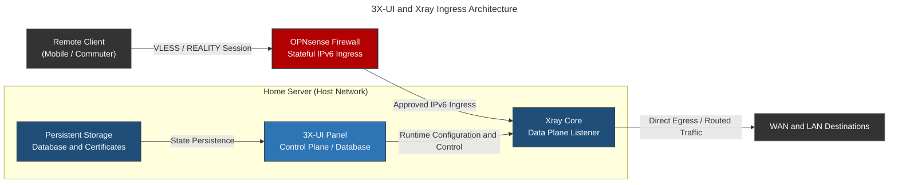
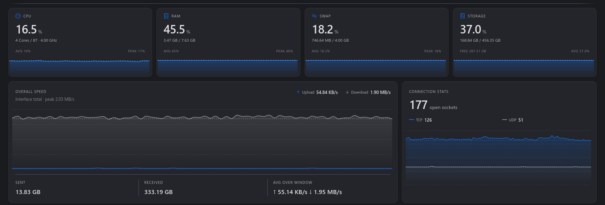
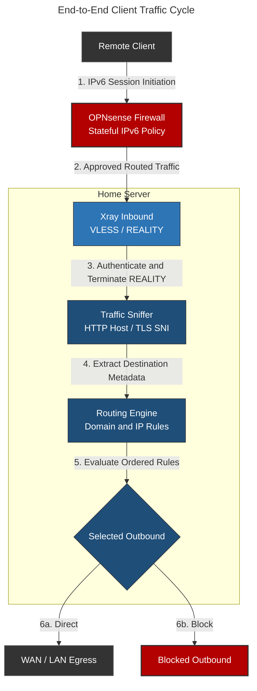
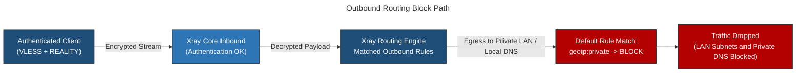

# 3X-UI / Xray: Encrypted Proxy Infrastructure

## Overview & Purpose

3X-UI manages Xray listeners, client identities, certificates, telemetry, and runtime configuration. Xray handles proxy connections and routes authenticated traffic.

Unlike a conventional VPN, Xray supports multiple proxy protocols and transport-security combinations intended for networks where ordinary proxy traffic may be filtered or actively probed. This deployment uses VLESS with REALITY so that authenticated proxy traffic follows a valid TLS handshake path without requiring a certificate for the proxy listener itself. This improves resistance to simple protocol fingerprinting, but it does not make the service undetectable or remove the need for strict listener and client configuration.

The deployment leverages direct IPv6 ingress through OPNsense. This bypasses Carrier-Grade NAT (CGNAT) restrictions on the residential IPv4 WAN while maintaining stateful edge firewall filtering over exposed listeners. The management control plane is logically isolated from public data-plane proxy listeners.

### Core Engine Architecture: Xray-Core

Xray operates as a modular, asynchronous network proxy engine. Its architecture separates traffic handling into several operational stages:

```mermaid
---
title: Xray Core Processing Stages
---
flowchart LR
    classDef core fill:#1f4e78,stroke:#333,color:#fff;
    classDef ops fill:#2e75b6,stroke:#333,color:#fff;
    classDef net fill:#333,stroke:#666,color:#fff;

    Inbound["Inbound Listener<br/>Protocol and Transport"]:::ops
    Security["Session Processing<br/>Authentication and Security"]:::core
    Sniffer["Traffic Sniffer<br/>HTTP Host / TLS SNI"]:::core
    Routing["Routing Engine<br/>Domain and IP Policy"]:::core
    Outbound["Outbound Handler<br/>Direct, Block, or Proxy"]:::net

    Inbound -->|1. Accept Session| Security
    Security -->|2. Authenticate and Decode| Sniffer
    Sniffer -->|3. Extract Destination Metadata| Routing
    Routing -->|4. Select Ordered Rule| Outbound
```



* **Public Inbound:** The active listener uses VLESS over TCP with REALITY transport security. Each client is identified by a UUID, and the listener parameters must match the client profile.
* **REALITY:** Authenticates approved clients while presenting a TLS handshake associated with a configured destination. Invalid or unauthenticated probes do not enter the authenticated proxy path.
* **Flow (`xtls-rprx-vision`):** Reduces redundant processing for supported TLS traffic while preserving the authenticated VLESS/REALITY session.
* **Traffic Sniffing:** Extracts supported HTTP host, TLS SNI, and QUIC metadata from the proxied stream so routing can evaluate the intended destination rather than only its IP address.
* **Outbounds:** The deployment uses `direct` for permitted traffic and `blackhole` for blocked traffic.
* **Routing:** Ordered rules evaluate inbound tags, protocol, destination domain, and destination address before selecting an outbound.

---

### Control Plane and Data Plane Separation

* **3X-UI Control Plane:** Stores configuration state in a local SQLite database, manages certificates via `acme.sh`, monitors interface traffic metrics, and serializes panel settings into Xray-compliant JSON configuration files.
* **Xray Data Plane:** Reads the generated JSON configuration, binds raw network sockets, handles cryptographic handshakes, processes packet streams, and dispatches egress traffic according to routing rules.
* **OPNsense Firewall:** Acts as the perimeter boundary, enforcing stateful IPv6 filtering on public proxy ports and restricting access to the 3X-UI management panel.
* **Persistent Storage:** Externalizes SQLite state, private keys, ACME certificate material, and log files outside the container filesystem.

---

## Deployment Architecture



### Operational View



*3X-UI dashboard showing host resources, proxy throughput, and connection counts.*

### Docker Container Configuration

```yaml
services:
  3x-ui:
    container_name: 3x-ui
    image: ghcr.io/mhsanaei/3x-ui
    network_mode: host
    cap_add:
      - NET_ADMIN
      - NET_RAW
    volumes:
      - <3X_UI_DATABASE_PATH>:/etc/x-ui/
      - <3X_UI_CERTIFICATE_PATH>:/root/cert/
      - <3X_UI_ACME_PATH>:/root/.acme.sh/
    environment:
      XRAY_VMESS_AEAD_FORCED: "false"
    restart: unless-stopped
    init: true
    tty: true
    healthcheck:
      test: ["CMD", "wget", "--spider", "--no-check-certificate", "https://localhost:<3X-UI_WEB_UI_PORT>/"]
      interval: 1m
      timeout: 10s
      retries: 3
      start_period: 10s
      start_interval: 5s

```

> **Deployment Rationale (Capabilities & Networking):**
> * **`network_mode: host`:** Allows Xray to bind directly to host IPv4 and IPv6 interfaces without Docker port translation. Every non-loopback listener therefore becomes part of the host attack surface and must be restricted at OPNsense.
> * **`NET_ADMIN`:** Permits network-interface and routing operations required by features that interact with the host network stack.
> * **`NET_RAW`:** Permits raw-socket operations. Because both capabilities expand the impact of a container compromise, they remain limited to this network service.
> * **`XRAY_VMESS_AEAD_FORCED=false`:** Retains compatibility with legacy non-AEAD VMess clients. It does not affect the VLESS/REALITY listener and can be removed when legacy VMess compatibility is no longer required.

### Sanitized Xray Runtime Configuration

The following excerpt is derived from the active Xray configuration but reduced to the controls that explain the deployment. Client identities, listener ports, REALITY key material, short IDs, destination names, and the internal subnet have been replaced with placeholders. Generated panel fields that do not affect the documented architecture are omitted.

<details>
<summary><strong>View sanitized Xray configuration</strong></summary>

```json
{
  "api": {
    "services": [
      "HandlerService",
      "LoggerService",
      "StatsService",
      "RoutingService"
    ],
    "tag": "api"
  },
  "dns": {
    "queryStrategy": "UseIP",
    "servers": [
      {
        "address": "localhost",
        "port": 53,
        "domains": ["home.arpa"],
        "queryStrategy": "UseIP"
      }
    ],
    "tag": "dns_inbound",
    "useSystemHosts": true
  },
  "inbounds": [
    {
      "listen": "127.0.0.1",
      "port": "<LOCAL_API_PORT>",
      "protocol": "tunnel",
      "settings": {
        "rewriteAddress": "127.0.0.1"
      },
      "tag": "api"
    },
    {
      "listen": "0.0.0.0",
      "port": "<PUBLIC_LISTENER_PORT>",
      "protocol": "vless",
      "settings": {
        "clients": [
          {
            "email": "<REDACTED_CLIENT_LABEL>",
            "flow": "xtls-rprx-vision",
            "id": "<REDACTED_CLIENT_UUID>"
          }
        ],
        "decryption": "none"
      },
      "sniffing": {
        "destOverride": ["http", "tls", "quic"],
        "enabled": true
      },
      "streamSettings": {
        "network": "tcp",
        "security": "reality",
        "realitySettings": {
          "mldsa65Seed": "<REDACTED>",
          "privateKey": "<REDACTED>",
          "serverNames": ["<REALITY_SERVER_NAME>"],
          "shortIds": ["<REDACTED_SHORT_ID>"],
          "show": false,
          "target": "<REALITY_TARGET>:443"
        },
        "tcpSettings": {
          "acceptProxyProtocol": false,
          "header": {
            "type": "none"
          }
        }
      },
      "tag": "public-vless-reality"
    }
  ],
  "log": {
    "access": "none",
    "dnsLog": true,
    "loglevel": "warning"
  },
  "metrics": {
    "listen": "127.0.0.1:<LOCAL_METRICS_PORT>",
    "tag": "metrics_out"
  },
  "outbounds": [
    {
      "protocol": "freedom",
      "settings": {
        "domainStrategy": "AsIs",
        "finalRules": [
          {
            "action": "allow",
            "ip": ["<HOME_LAN_CIDR>"]
          },
          {
            "action": "block",
            "ip": ["geoip:private"]
          },
          {
            "action": "allow"
          }
        ]
      },
      "tag": "direct"
    },
    {
      "protocol": "blackhole",
      "settings": {},
      "tag": "blocked"
    }
  ],
  "policy": {
    "levels": {
      "0": {
        "statsUserDownlink": true,
        "statsUserOnline": true,
        "statsUserUplink": true
      }
    },
    "system": {
      "statsInboundDownlink": true,
      "statsInboundUplink": true,
      "statsOutboundDownlink": true,
      "statsOutboundUplink": true
    }
  },
  "routing": {
    "domainStrategy": "AsIs",
    "rules": [
      {
        "inboundTag": ["api"],
        "outboundTag": "api",
        "type": "field"
      },
      {
        "outboundTag": "blocked",
        "protocol": ["bittorrent"],
        "type": "field"
      }
    ]
  }
}
```

</details>

#### Why VLESS, XTLS Vision, and REALITY

VLESS provides lightweight client identity and framing without attempting to supply transport encryption itself. REALITY supplies the authenticated transport-security layer and allows the listener to follow the TLS characteristics of a configured destination without maintaining a conventional certificate for that inbound. `xtls-rprx-vision` reduces redundant processing for supported TLS traffic while retaining the authenticated VLESS/REALITY path.

The configured ML-DSA seed allows compatible REALITY clients to verify an additional post-quantum signature attached to the temporary certificate path. The seed is private key material and must remain confidential.

The REALITY private key, ML-DSA seed, short IDs, target, and accepted server names are operational security material. They are represented only as placeholders because publishing them would make the live listener easier to fingerprint or probe.

#### Why the API and Metrics Listeners Use Loopback

3X-UI uses Xray's handler, logger, statistics, and routing services to manage the process and collect panel telemetry. The generated API inbound and metrics listener bind to `127.0.0.1`, keeping the control plane off external interfaces. These listeners expose administrative functions and operational metadata and are not part of the public proxy path.

#### DNS and Destination Sniffing

The built-in DNS configuration directs `home.arpa` lookups to the resolver running on the host and uses `UseIP` to permit both A and AAAA results. `useSystemHosts` also makes host-level name mappings available to Xray.

Sniffing extracts supported HTTP host, TLS SNI, or QUIC metadata from proxied traffic so routing can evaluate the intended domain rather than only an IP address. It supports routing decisions; it does not decrypt arbitrary end-to-end application content.

#### Ordered Outbound Policy

The `direct` outbound evaluates its final rules in order:

1. The homelab subnet is explicitly allowed so remote clients can reach approved internal services and the local resolver.
2. Other addresses classified as `geoip:private` are blocked to prevent unintended access to unrelated private ranges.
3. Remaining public destinations are allowed.

The order is intentional. Placing the broad private-address block before the homelab exception caused the incident documented later in this file.

#### BitTorrent, Telemetry, and Logging Policy

Traffic identified as BitTorrent is routed to the `blackhole` outbound to reduce peer-to-peer use through the proxy. Protocol classification is a policy control, not a guarantee that every peer-to-peer flow will be recognized.

Per-user and per-direction statistics remain enabled for the 3X-UI dashboard. Access logging is disabled to reduce retained browsing metadata, while warning-level application logs and DNS logging preserve enough information for operational diagnosis. This is a deliberate privacy-versus-observability trade-off.

---

### End-to-End Client Traffic Cycle



1. **Ingress Initiation:** The remote client application initiates a TCP/UDP connection targeted at the host's public IPv6 address on an assigned inbound port.
2. **Perimeter Filtering:** OPNsense evaluates the connection against stateful IPv6 WAN policy. If permitted, the packet is routed to the listener on the home server; no IPv6 port translation is required.
3. **Inbound Termination & Authentication:** Xray validates the VLESS client identity and REALITY handshake. Invalid sessions follow the configured fallback behavior without entering the authenticated proxy path.
4. **Sniffing & Unwrapping:** After authentication and transport processing, Xray can inspect supported HTTP host or TLS SNI metadata from the proxied stream to identify the intended destination.
5. **Policy Routing Evaluation:** The routing engine compares the target domain or destination IP against defined rules:
   * **Domain matching:** Checks `geosite` rules, explicit domains, and domain suffixes.
   * **IP CIDR matching:** Evaluates destination addresses against `geoip` categories and local subnet declarations.

6. **Egress Execution:** Traffic is dispatched out through the selected outbound interface (e.g., `direct` to the local gateway or home subnets) or immediately dropped if marked for sinkholing.

---

## Listener and Certificate Model

Each inbound combines a transport definition, client identity, listener address, and routing policy. Client profiles must match the server-side transport and security parameters exactly; a valid network path alone is insufficient to establish a functional session.

Certificate state is mounted independently from the panel SQLite database. This decouples container recreation from SSL/TLS state, ensuring active Let's Encrypt / ZeroSSL certs and `acme.sh` renewal tokens remain intact across image upgrades.

The management panel and public proxy listener use separate configured access policies:

* **Proxy Listeners:** Exposed through approved public IPv6 listeners using authenticated REALITY or TLS transport security.
* **Management Panel:** Bound to a separate local listener. OPNsense policy is configured to block WAN access and permit management from the trusted LAN or administrative tunnels.

---

## Security Rationale & Trade-offs

### Host Networking Implications

Host networking eliminates Docker network translation but reduces container isolation. Any service bound by 3X-UI or Xray to `0.0.0.0` or `::` becomes reachable on the corresponding host interfaces unless restricted by host or upstream firewall policy.

### Privileged Network Capabilities

`NET_ADMIN` and `NET_RAW` grant privileges beyond standard Docker container isolation. These capabilities allow Xray to interact with host interfaces and perform low-level socket operations, but they expand the attack surface if the 3X-UI or Xray binary were compromised.

### Credentials and Private State

The 3X-UI SQLite database stores client UUIDs, proxy secret keys, panel login parameters, and traffic analytics. Certificate directories contain RSA/ECC private keys. Mount paths on the host filesystem must use restrictive file permissions (`0700` directories, `0600` files) to prevent unauthorized local read access.

### Lifecycle & Update Safety

Re-pulling the container image updates both the 3X-UI panel and the bundled Xray-core binary. Core updates can change configuration templates or routing behavior, so the SQLite database, generated configuration, and key material are backed up before replacement and connectivity is validated afterward.

---

## Failure Modes, Incidents, and Resolution

### Common Failure Modes

| Failure | Diagnostic Path | Resolution |
| --- | --- | --- |
| **Listener Unreachable** | Check the container and Xray process, verify the host socket with `ss -tulpn`, confirm the active IPv6 address, and inspect OPNsense WAN rules | Restart Xray from the panel, restore the listener or firewall path, and confirm that the delegated IPv6 prefix has not changed |
| **TLS / REALITY Handshake Failure** | Inspect client and Xray logs; compare the REALITY destination, server name, key material, short ID, flow mode, and system time | Correct the mismatched client or server parameter; renew certificates only for listeners that use conventional TLS |
| **Panel Reachable but Proxy Offline** | Check the panel's Xray status, validate the generated configuration, and review container and Xray logs | Correct the invalid inbound, routing entry, or listener conflict, then restart Xray through the panel |
| **Client Authenticates but Has No Internet Access** | Review Xray Outbounds configuration, test server-side outbound DNS resolution, and check host routing tables | Correct `direct` outbound routing policy, verify system resolver availability, and check default gateway connectivity |
| **State Lost After Container Recreation** | Verify host bind mounts for database (`/etc/x-ui/`) and certificates (`/root/cert/`) in Compose file | Restore persistent SQLite database file from local backup and re-verify directory ownership |
| **Port Conflict on Inbound Startup** | Inspect container logs for `bind: address already in use` errors; identify host process occupying the port via `ss -tulpn` | Reassign the conflicting inbound port in 3X-UI or stop the competing host process |

---

### Incident Post-Mortem: LAN Access and Private-DNS Failure Caused by Global Private-IP Blocking

#### Incident Summary

During a remote commute, access to internal homelab services and names that depended on the local resolver failed over the active Xray proxy connection. The client still completed the VLESS handshake and displayed normal session indicators, but requests to LAN destinations timed out and the configured local DNS resolver was unreachable.

#### Root Cause Analysis (RCA)

Following an upstream update to the Xray core template managed by the 3X-UI panel, the global routing template applied a strict default blocking rule to the primary `direct` outbound.

Specifically, `geoip:private` was assigned a `block` action without a higher-priority exception for the homelab subnet. That category includes RFC 1918 and other non-public address ranges, so Xray dropped traffic to internal services and to the local Pi-hole/Unbound resolver. Names routed through that resolver therefore failed even though the authenticated proxy session itself remained established.



#### Diagnostic Process

1. **Layer 3 & Socket Reachability Verification:** Executed a domain lookup and ICMP ping from the client device to the remote proxy domain. Confirmed that DNS resolved correctly and the host port was reachable over IPv6.
2. **Session Layer Integrity Check:** Verified through the Xray client logs that the VLESS/REALITY session was successfully established and the public exit IP matched the homelab WAN interface.
3. **Resolver Path Test:** Confirmed that the configured local resolver used a private destination and remained unreachable through the proxy. Combined with direct private-address failures, this pointed to a broad private-range policy rather than an outage of the resolver daemon itself.
4. **Direct IP Navigation Test:** Attempted connections to known internal services using their addresses rather than hostnames. These requests also timed out, confirming that private-address traffic was being blocked independently of name resolution.
5. **Panel Configuration Review:** Inspected **Xray Configuration / Panel Settings → Outbounds** in 3X-UI and found the following global rule:

```json
{
  "finalRules": [
    {
      "action": "block",
      "ip": ["geoip:private"]
    },
    {
      "action": "allow"
    }
  ]
}
```

This rule explicitly intercepted all internal RFC 1918 traffic and dropped it at the routing engine layer before it could exit host interfaces.

#### Remediation & Resolution

1. **Routing Rule Hierarchy Adjustment:** Modified the global Xray template within the 3X-UI Outbound settings.
2. **Specific LAN Exemption Rule Insertion:** Created a higher-priority allow rule for the homelab subnet above the catch-all `geoip:private` block. Other private ranges remained blocked.

```json
{
  "finalRules": [
    {
      "action": "allow",
      "ip": ["<HOME_LAN_CIDR>"]
    },
    {
      "action": "block",
      "ip": ["geoip:private"]
    },
    {
      "action": "allow"
    }
  ]
}
```

3. **Service Restart & Validation:** Restarted the Xray core daemon via the panel control interface. Disconnected the mobile endpoint from local Wi-Fi, established a remote connection over cellular data, and confirmed full operational access to both local homelab infrastructure and general web traffic.
