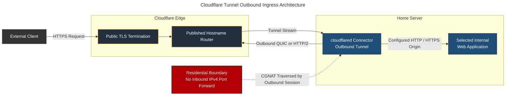
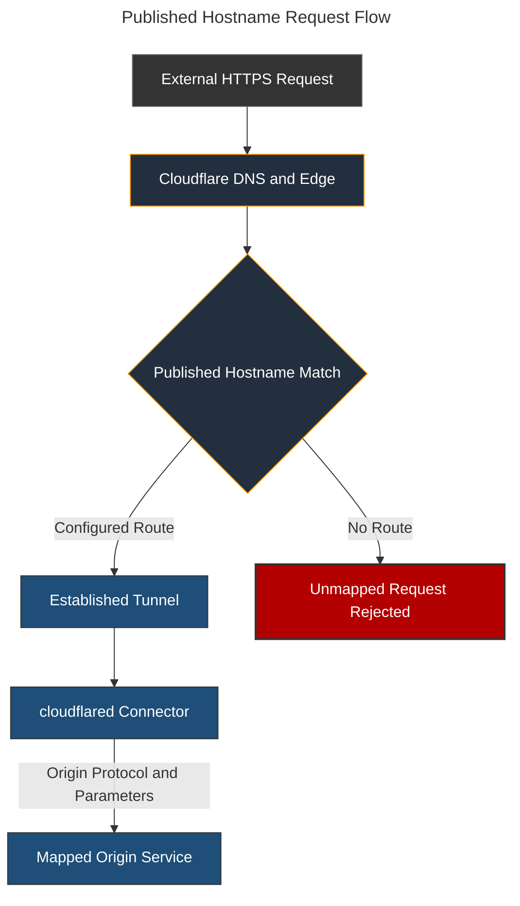

# Cloudflare Tunnel: Outbound Application Ingress & CGNAT Traversal

## Overview & Purpose

Cloudflare Tunnel provides public IPv4 access to selected internal web applications without requiring inbound port forwarding or a publicly routed residential IPv4 address. A containerized `cloudflared` connector initiates an outbound encrypted connection to Cloudflare's edge, allowing application traffic to traverse Carrier-Grade NAT (CGNAT) while keeping the origin address and local service topology private.

The tunnel is an application-ingress path rather than a general-purpose VPN. Each published hostname maps to a specific internal origin, and access to that application remains subject to its own authentication or an explicitly configured Cloudflare Access policy.

### Core Connector Architecture: `cloudflared`

The `cloudflared` daemon performs three roles:

* **Tunnel Establishment:** Initiates outbound connections to Cloudflare over QUIC or HTTP/2. With automatic protocol selection, QUIC is preferred and HTTP/2 provides a TCP-based fallback where UDP is unavailable.
* **Hostname Routing:** Receives requests for configured public hostnames over the established tunnel and maps them to the corresponding local origin service.
* **Origin Proxying:** Opens a separate HTTP or HTTPS connection from the connector to the internal application using the configured origin parameters.

Public TLS terminates at Cloudflare's edge. The request then crosses the encrypted tunnel to `cloudflared`, which creates the final connection to the origin. Whether that final hop uses HTTP or HTTPS is an independent deployment choice.

---

## Deployment Architecture



### Docker Container Configuration

```yaml
services:
  cloudflared:
    container_name: cloudflared
    image: cloudflare/cloudflared
    command: tunnel --no-autoupdate run --token ${TUNNEL_TOKEN}
    network_mode: host
    restart: unless-stopped

```

> **Deployment Rationale:**
> * **`network_mode: host`:** Allows `cloudflared` to reach origins bound to the server's loopback or host interfaces without Docker bridge gateway addresses or duplicated port mappings.
> * **`--no-autoupdate`:** Disables the daemon's internal updater because the binary is managed through the container image lifecycle.
> * **`${TUNNEL_TOKEN}`:** Supplies the credential for this connector to join the remotely managed tunnel. The value is stored outside version control and rotated if disclosure is suspected.
> * **`restart: unless-stopped`:** Restores the connector after a host or container-runtime restart while still allowing intentional administrative shutdown.

The tunnel token, tunnel identifier, public hostnames, and origin addresses are intentionally excluded from this repository.

---

## Request Routing & Ingress Engine



### Routing Layers

A published application route contains three distinct mappings:

1. **Public DNS:** Directs the application hostname to Cloudflare's edge and associates it with the tunnel.
2. **Tunnel Route:** Maps that hostname to a service definition for the connector.
3. **Origin Request:** Defines how `cloudflared` reaches the application, including protocol, destination, TLS server name, certificate validation, and timeout behavior where required.

The tunnel connection and an individual application route have separate health states. A connector can remain online while a hostname returns an error because its origin is stopped, bound to a different interface, using the wrong protocol, or presenting an invalid certificate.

### Transport Selection

`cloudflared` can establish the edge connection using QUIC over UDP or HTTP/2 over TCP. Automatic selection prefers QUIC and falls back to HTTP/2 when UDP cannot be established. Outbound firewall policy must permit the selected transport and its return traffic; no corresponding inbound WAN rule is required.

---

## Security Rationale & Trade-offs

### CGNAT Traversal Without Inbound Port Forwarding

The connector originates the edge session from inside the network. This permits public IPv4 application ingress despite residential CGNAT and avoids exposing the home server through a direct IPv4 listener on the router.

This removes one ingress path; it does not make the origin inherently secure. The application, connector, Cloudflare account, DNS zone, and tunnel credential all remain part of the security boundary.

### Origin Address Isolation

External clients connect to Cloudflare rather than directly to the residential address. Public DNS does not disclose the internal origin address, and only explicitly mapped applications are carried through the tunnel.

### TLS and Inspection Boundary

Cloudflare terminates the public TLS session to apply edge routing and configured security controls. Cloudflare can therefore process the plaintext HTTP request before forwarding it through the tunnel. This introduces a deliberate trust dependency on the provider.

The connector-to-origin hop can use HTTPS when confidentiality or origin authentication is required inside the local network. For private certificate authorities, supplying the appropriate CA certificate is preferable to disabling verification. `noTLSVerify` should be treated as a last resort because it removes certificate validation on that hop.

### Authentication Boundary

Cloudflare Tunnel authenticates the connector and protects the transport path, but it does not automatically authenticate the person requesting a published hostname. Administrative or private applications require either application-level authentication or a Cloudflare Access policy.

The tunnel is not treated as a Zero Trust control. That description would require identity-aware policy, explicit authorization rules, monitoring, and verified enforcement beyond connector authentication.

### Credential Scope

Possession of the tunnel token allows another connector to join that tunnel. The token is injected at runtime, excluded from the repository, and rotated through the Cloudflare control plane after suspected exposure.

### Provider and Control-Plane Dependency

Availability depends on Cloudflare DNS and edge services, the tunnel configuration, the local connector, residential egress, and the destination application. Configuration mistakes or provider-side disruption can make the public path unavailable even while the local application remains healthy.

---

## Failure Modes & Resolution

### Common Failure Modes

| Failure | Diagnostic Path | Resolution |
| --- | --- | --- |
| **Tunnel disconnected** | Inspect `cloudflared` logs, verify DNS and system time, and test outbound connectivity to Cloudflare over the permitted tunnel transports | Restore outbound DNS or network access, remove an incorrectly forced protocol, or rotate an invalid tunnel token |
| **Public hostname not routed** | Confirm the hostname's DNS association, published application route, and tunnel selection | Correct the hostname-to-tunnel mapping and verify the route is attached to the active tunnel |
| **502 Bad Gateway** | Confirm the connector is online, then test the configured origin directly from the home server | Start the origin or correct its address, port, protocol, or interface binding |
| **Origin timeout** | Compare local origin latency with the external request and inspect host resource pressure | Restore the application dependency or adjust an intentionally short origin timeout after diagnosing the delay |
| **Origin TLS validation failure** | Compare the configured origin name with the certificate SAN, trust chain, and protocol | Correct the server name or certificate chain; provide the private CA instead of disabling verification where possible |
| **QUIC connection failure** | Check whether outbound UDP is filtered while TCP remains available | Use automatic protocol selection or permit the required UDP egress; force HTTP/2 only when the network requires it |
| **Application publicly reachable without intended authentication** | Test the published hostname from an unauthenticated session and review application or Access policy coverage | Remove the route until application authentication or an explicit identity-aware access policy is enforced |
| **Tunnel healthy but end-to-end check fails** | Compare connector status, local origin response, DNS resolution, and an external HTTPS request | Repair the failing layer rather than restarting the healthy connector indiscriminately |
