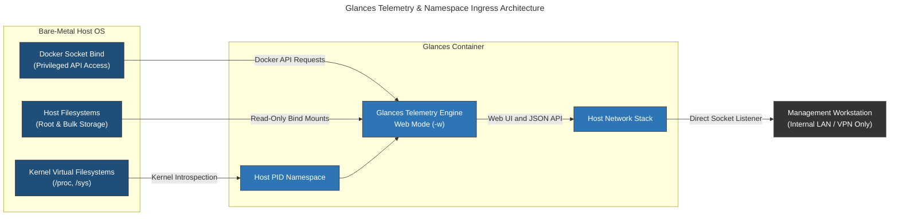
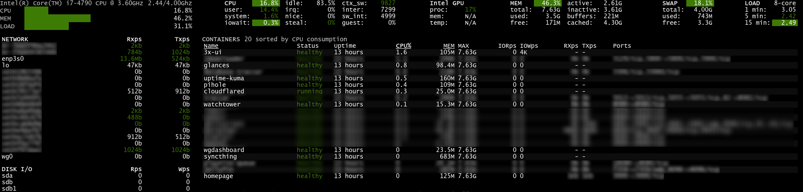
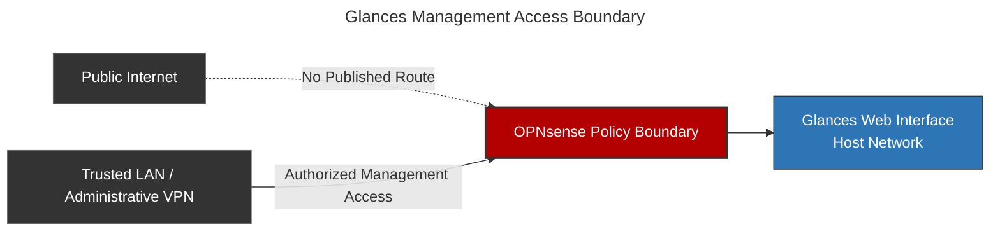

# Glances: Host & Container Telemetry Engine

## Overview & Purpose

Glances is the primary real-time telemetry interface for the bare-metal homelab server and its containerized workloads. It combines process activity, storage I/O, memory pressure, network throughput, sensor data, and Docker container state for resource diagnosis.

To provide host-level visibility while remaining containerized, Glances shares the host Process ID (`pid`) and network namespaces and receives read-only bind mounts for selected filesystems. These choices trade part of Docker's namespace isolation for direct visibility into the underlying operating system.

### Telemetry Engine Architecture

Glances uses Python's `psutil` library and Linux kernel interfaces such as `/proc` and `/sys` to collect system metrics. Web mode (`-w`) presents the collected telemetry through the Glances web interface and API.

* **`/proc` Introspection:** Reads host process state, CPU thread utilization, system load averages, and memory allocations directly from kernel data structures.
* **Docker Socket IPC:** Communicates over the Unix domain socket (`/var/run/docker.sock`) to query the Docker Engine API for container status, CPU/memory cgroup limits, and network I/O per container.
* **Runtime Metric State:** Current process and resource data are collected dynamically rather than persisted as a long-term time-series database.

---

## Deployment Architecture



### Docker Container Configuration

```yaml
services:
  glances:
    container_name: glances
    image: nicolargo/glances
    environment:
      GLANCES_OPT: "-w"
    pid: host
    network_mode: host
    volumes:
      - /var/run/docker.sock:/var/run/docker.sock:ro
      - <ROOT_STORAGE>:/mnt/root-storage:ro
      - <BULK_STORAGE>:/mnt/bulk-storage:ro
    restart: unless-stopped
    healthcheck:
      test: ["CMD", "curl", "-f", "http://localhost:<GLANCES_WEB_UI_PORT>"]
      interval: 1m
      timeout: 10s
      retries: 3
      start_period: 10s
      start_interval: 5s

```

> **Deployment Rationale & Privilege Scoping:**
> * **`pid: host`:** Removes Process ID namespace isolation so Glances can inspect host processes, system daemons, and sibling-container processes through the host `/proc` view.
> * **`network_mode: host`:** Places Glances in the host network namespace, allowing it to observe the server's physical and virtual interfaces directly and expose its web listener without Docker port translation.
> * **`/var/run/docker.sock:ro`:** Prevents replacement of the socket file through the bind mount, but does **not** make Docker API operations read-only. Access to the Docker socket remains equivalent to highly privileged host access and is treated accordingly.
> * **Bind Mounts (`:ro`):** Mounts target host filesystems as read-only volumes, allowing Glances to execute `statvfs()` system calls for storage capacity reporting without granting write access to raw storage.

---

## Metric Sources & Introspection Matrix

Glances aggregates data across multiple system layers to differentiate between localized application issues and global host resource exhaustion:

| Metric Category | Data Source / Mechanism | Operational Security & Diagnostic Value |
| --- | --- | --- |
| **Host System Load** | `/proc/loadavg` & `/proc/stat` | Distinguishes between CPU-bound thread saturation and I/O wait state locks (`iowait`). |
| **Process Inspection** | `/proc/[pid]/` status files | Identifies runaway processes, memory leaks, zombie processes, and high-resource consumers across the host. |
| **Container Telemetry** | `/var/run/docker.sock` (Docker API) | Correlates host CPU/RAM spikes directly with specific container IDs and names. |
| **Storage Subsystem** | `statvfs()` via `/mnt/*` bind mounts | Tracks disk capacity utilization, block read/write rates, and disk queue congestion. |
| **Network Interfaces** | Kernel network statistics | Monitors real-time throughput, packet counts, drops, and interface errors. |
| **Hardware Health** | `/sys/class/thermal/` & `lm-sensors` | Provides CPU package thermal monitoring to detect hardware-level thermal throttling under load. |

> [!NOTE]
> **Observability vs. Availability Separation:**
> Glances provides **high-frequency resource metric introspection** (resource bottlenecks, CPU saturation, memory pressure). Synthetic uptime and network reachable state monitoring (service heartbeat checks) are explicitly delegated to **Uptime Kuma** running as a separate service to avoid single-point-of-failure reporting.

### Operational View



*Sanitized Glances summary showing host resource and sensor telemetry without interface identifiers or listener details.*

---

## Security Rationale & Trade-offs

Glances can inspect host processes and access the Docker API, so a compromise could expose process metadata or lead to privileged Docker operations.

### Security Trade-offs & Risk Mitigation

> [!WARNING]
> **1. Docker Socket Privilege (`/var/run/docker.sock:ro`):**
> The `:ro` bind option does not impose read-only semantics on requests sent through the Unix socket. A compromised process with usable socket access may be able to issue privileged Docker API operations. The socket mount therefore places Glances inside the host's administrative trust boundary.
> **2. Process Table Exposure (`pid: host`):**
> By running in the host PID namespace, Glances can see every process running on the host, including process arguments (e.g., CLI arguments passed to scripts). If a user passes plaintext credentials via CLI commands, those arguments are exposed in the process table.

### Perimeter Defense & Isolation Strategy

The configured access policy limits the interface to trusted management paths:



* **No Public Route:** Glances is not published through Cloudflare Tunnel, a reverse proxy, or a WAN port forward.
* **Network Segmentation:** Network policy permits access from the internal management segment and authorized WireGuard peers.
* **Read-Only Storage Mounts:** Host storage is exposed to Glances with read-only bind mounts. This limits filesystem writes but does not reduce the separate privilege associated with Docker socket access.

---

## Failure Modes & Resolution

### Common Failure Modes

| Failure Mode | Root Cause Analysis | Diagnostic Command / Path | Resolution |
| --- | --- | --- | --- |
| **Container Metrics Missing** | Docker socket unreadable or socket permissions restricted on host. | Run `docker exec -it glances ls -la /var/run/docker.sock` to check socket existence and permissions. | Ensure host socket permissions allow read access and verify the `:ro` bind mount in `docker-compose.yml`. |
| **Host Processes Incomplete** | Container running in isolated PID namespace instead of host PID. | Execute `docker exec -it glances ps aux` and check if host PIDs (like PID 1 `/sbin/init` or `systemd`) are visible. | Recreate the container ensuring `pid: host` is explicitly defined in the Compose file. |
| **Missing Filesystems / Mounts** | Bind mount path invalid or underlying host storage unmounted. | Check `df -h` on the host and compare against container mounts in `docker inspect glances`. | Verify host mount paths exist before starting the container; restore bind paths in volume definitions. |
| **Thermal Sensors Unavailable** | Required kernel sensor interface is unavailable to Glances. | Run `sensors` on the host and inspect `/sys/class/thermal/`. | Restore the appropriate host sensor module or accept omission where the platform does not expose the metric. |
| **Excessive Monitoring CPU Load** | Glances polling interval set too low, forcing frequent `/proc` re-scans and Docker API queries. | Check Glances container CPU usage via `docker stats glances` or inspect `-t` (time interval) flag. | Increase the polling interval in `GLANCES_OPT` (e.g., `GLANCES_OPT="-w -t 3"` for a 3-second refresh cycle). |
| **Web Interface Unreachable** | Glances is stopped, its web listener failed, or management-network policy blocks the path. | Verify the container, inspect Glances logs, and check the host listener with `ss -tulpn`. | Restore the service listener or the narrow management-network rule. |
