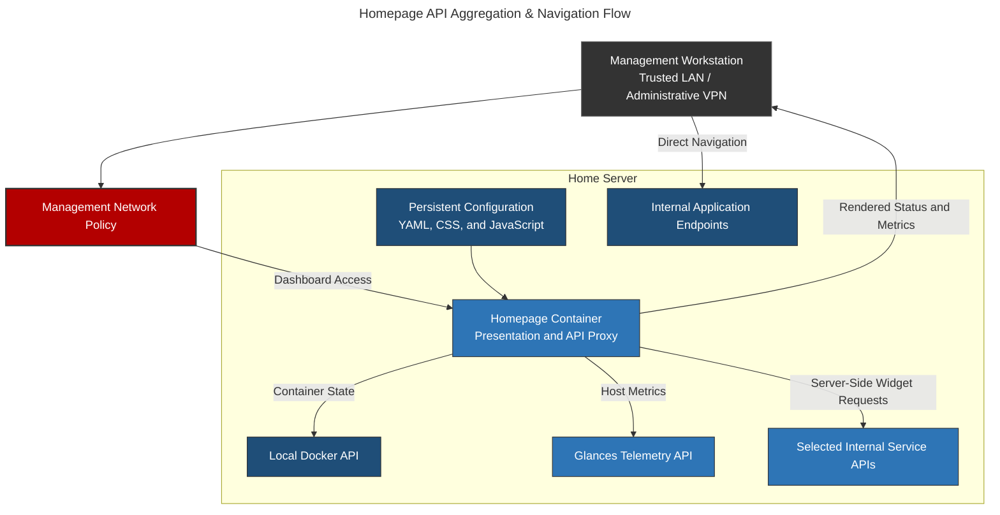

# Homepage: Unified Operational Portal & API Aggregator

## Overview & Purpose

Homepage (`gethomepage.dev`) provides the central operational portal for the homelab. It combines service navigation, Docker runtime state, lightweight reachability checks, host telemetry, and selected application metrics in one responsive interface.

Homepage is the presentation and aggregation layer rather than the authoritative monitoring or management system:

* **Availability Monitoring:** Uptime Kuma performs persistent endpoint checks and alerting.
* **Host Telemetry:** Glances exposes CPU, memory, storage, sensor, and network metrics.
* **Container Management:** Portainer and the Docker CLI handle workload lifecycle operations.
* **Navigation and Aggregation:** Homepage organizes links, status indicators, and selected API data.

### Core Architecture: Declarative Configuration & Server-Side Widget Proxying

Homepage is configured through YAML files mounted under `/app/config`. Service groups, Docker integrations, layout, information widgets, and API-backed service widgets are maintained independently from the container image, allowing the dashboard to be recreated without rebuilding its configuration manually.

API-backed widgets use Homepage's server-side proxy layer. The Homepage process sends requests to internal APIs and returns only the widget data required by the browser. This avoids browser CORS restrictions and reduces direct disclosure of integration credentials to client-side code. It does not remove the need to protect the configuration files in which those credentials originate.

---

## Deployment Architecture



### Docker Container Configuration

```yaml
services:
  homepage:
    container_name: homepage
    image: ghcr.io/gethomepage/homepage
    ports:
      - "<HOMEPAGE_UI_PORT>:<HOMEPAGE_UI_PORT>"
    volumes:
      - <HOMEPAGE_CONFIG_PATH>:/app/config
      - /var/run/docker.sock:/var/run/docker.sock:ro
    environment:
      HOMEPAGE_ALLOWED_HOSTS: "<INTERNAL_HOMEPAGE_HOST>:<HOMEPAGE_UI_PORT>"
    restart: unless-stopped
    init: true
```

> **Deployment Rationale & Security Scoping:**
> * **`init: true`:** Adds a minimal init process as PID 1 for signal forwarding and child-process reaping during container shutdown and widget execution.
> * **Persistent `/app/config`:** Keeps layout, service definitions, widgets, and presentation overrides outside the container lifecycle.
> * **`HOMEPAGE_ALLOWED_HOSTS`:** Restricts accepted HTTP `Host` values and protects Homepage's API proxy from requests made through unexpected hostnames.
> * **Docker Socket:** Enables local container discovery and status reporting. The `:ro` bind flag does not make Docker API requests read-only; usable access to the socket remains highly privileged.

---

## Configuration Architecture

The live dashboard is assembled from several files with distinct responsibilities:

| File | Responsibility |
| --- | --- |
| `docker.yaml` | Defines Docker environments used for container-state discovery |
| `services.yaml` | Organizes service groups, navigation targets, monitors, and API-backed widgets |
| `settings.yaml` | Controls theme, layout, tabs, status presentation, and background behavior |
| `widgets.yaml` | Defines global information widgets such as uptime, date/time, and weather |
| `custom.css` | Implements responsive visual adjustments without modifying the application image |
| `custom.js` | Provides optional client-side behavior; currently no deployment-specific logic is required |

### Docker Environment Discovery

```yaml
docker:
  socket: /var/run/docker.sock

additional-docker-host:
  host: <DOCKER_API_HOST>
  port: <PROTECTED_DOCKER_API_PORT>
```

The local socket supplies status for containers running on the Homepage host. Homepage can also query an additional Docker endpoint when required. A Docker API exposed over unauthenticated plain TCP grants effective control of the Docker host; any network endpoint must therefore use mutual TLS, an authenticated socket proxy, or an equivalently restrictive control.

### Sanitized Service Definitions

The following excerpt shows the integration model with internal names, addresses, credentials, physical camera labels, cloud identifiers, and unrelated services removed:

```yaml
- Network & Edge:
    - Perimeter Firewall:
        href: https://<INTERNAL_FIREWALL_HOST>/
        description: Routing and network policy
        widget:
          type: opnsense
          url: https://<INTERNAL_FIREWALL_HOST>/
          username: "{{HOMEPAGE_VAR_FIREWALL_KEY}}"
          password: "{{HOMEPAGE_VAR_FIREWALL_SECRET}}"

    - Encrypted Proxy:
        href: https://<INTERNAL_PROXY_HOST>/
        description: Xray management panel
        server: additional-docker-host
        container: 3x-ui
        siteMonitor: https://<INTERNAL_PROXY_HOST>/

- Monitoring & Operations:
    - Host Telemetry:
        href: http://<INTERNAL_GLANCES_HOST>/
        description: Host and container resource monitoring
        server: additional-docker-host
        container: glances
        siteMonitor: http://<INTERNAL_GLANCES_HOST>/

    - Container Management:
        href: http://<INTERNAL_PORTAINER_HOST>/
        description: Docker management interface
        server: additional-docker-host
        container: portainer
        widget:
          type: portainer
          url: http://<INTERNAL_PORTAINER_HOST>
          env: <PORTAINER_ENVIRONMENT_ID>
          key: "{{HOMEPAGE_VAR_PORTAINER_KEY}}"

- Files & Sync:
    - File Synchronization:
        href: http://<INTERNAL_SYNC_HOST>/
        description: Peer-to-peer file synchronization
        server: additional-docker-host
        container: syncthing
        widget:
          type: customapi
          url: http://<INTERNAL_SYNC_HOST>/<SANITIZED_API_PATH>
          headers:
            X-API-Key: "{{HOMEPAGE_VAR_SYNCTHING_KEY}}"
          mappings:
            - field: numFolders
              label: Folders
              format: number
            - field: numDevices
              label: Devices
              format: number
```

Homepage environment-variable substitution keeps secrets out of `services.yaml`. Secret variable names must use Homepage's supported `HOMEPAGE_VAR_` or file-backed `HOMEPAGE_FILE_` prefixes. The values still exist in the container environment or mounted secret files and require appropriate host permissions.

### Layout & Information Widgets

```yaml
# settings.yaml
 title: Dashboard
 theme: dark
 color: slate
 disableCollapse: true
 hideVersion: true
 headerStyle: underlined
 hideErrors: true
 showStats: true
 statusStyle: dot

 layout:
   Services:
     tab: Services
     style: row
     columns: 3
   System Stats:
     tab: Services
     style: row
     columns: 2
   Custom API:
     tab: Custom API
     style: row
     columns: 1
```

```yaml
# widgets.yaml
- resources:
    label: Uptime
    uptime: true

- datetime:
    locale: <LOCALE>
    text_size: xl
    format:
      dateStyle: short
      timeStyle: short
      hourCycle: h23

- openmeteo:
    label: <GENERAL_LOCATION>
    timezone: <TIMEZONE>
    latitude: <SANITIZED_LATITUDE>
    longitude: <SANITIZED_LONGITUDE>
    units: metric
    cache: 5
```

Tabs and nested groups separate service navigation, infrastructure statistics, and custom operational actions. Responsive CSS changes card radius, tab wrapping, metric-bar styling, and widget spacing for desktop and mobile layouts without forking the upstream interface.

---

## Service & Widget Integration Architecture

| Integration Type | Communication Channel | Operational Role |
| --- | --- | --- |
| **Docker State** | Local Unix socket or protected Docker API endpoint | Associates service entries with container state and health metadata |
| **Service Widgets** | Server-side HTTP requests through Homepage's API proxy | Retrieves narrowly selected data from supported service APIs |
| **Site Monitoring** | HTTP reachability checks initiated by Homepage | Provides immediate dashboard indicators, not historical monitoring or alerting |
| **Host Telemetry** | Glances API widgets | Presents CPU, memory, sensor, and filesystem summaries |
| **Navigation Links** | Direct browser requests to internal hostnames | Opens the destination application without forwarding identity or authorization |
| **Custom API Widgets** | Server-side request with explicit field mappings | Reduces a larger API response to selected operational values |

Homepage's status indicators are useful for navigation and rapid triage, but Uptime Kuma remains the authoritative system for persistent availability history and notifications.

---

## Security Rationale & Trade-offs

### Docker API Exposure

Docker integration places Homepage close to the container control plane. The Unix socket's file mount may be marked `:ro`, but this does not make API methods read-only. If Homepage or one of its dependencies were compromised, accessible Docker endpoints could become a path to host-level control.

An authenticated socket proxy could expose less of the Docker API. In the current design, network policy is configured to restrict Homepage and its Docker endpoint to the management network rather than public ingress.

### Server-Side Proxy Boundary

Homepage's widget proxy reduces browser exposure to backend credentials and resolves CORS constraints, but it also makes Homepage an aggregation point for privileged internal APIs. Network policy is configured to limit the dashboard and its API routes to trusted management paths.

### Host Header Validation

`HOMEPAGE_ALLOWED_HOSTS` limits which hostnames may access Homepage's API proxy. Values include only the internal names actually used to reach the dashboard; wildcard entries are avoided.

### Authentication and Navigation

Homepage does not provide SSO or propagate identity to linked applications. A visible link or healthy status does not grant authorization. Every destination retains its own authentication, session, and network controls.

---

## Failure Modes & Resolution

### Common Failure Modes

| Failure Mode | Diagnostic Path | Resolution |
| --- | --- | --- |
| **Configuration error or blank group** | Validate all mounted YAML files and inspect `docker logs homepage` for parser errors | Correct indentation, duplicate keys, or invalid widget structure and reload Homepage |
| **Docker status unavailable** | Identify whether the service entry references the local socket or an additional Docker endpoint, then test that connection | Restore the socket or protected API path and confirm the configured Docker environment name |
| **Widget reports an API error** | Test the target API from the Homepage container and verify the environment-backed credential | Correct routing, API compatibility, or credential scope without placing the secret back into YAML |
| **Host rejected** | Compare the browser's `Host` header with `HOMEPAGE_ALLOWED_HOSTS` | Add only the intended internal hostname and port, then recreate the container |
| **Service link fails while its widget works** | Test client-side DNS separately from the server-side widget request | Correct split-horizon DNS or the navigation URL; the two paths originate from different systems |
| **Site monitor disagrees with Uptime Kuma** | Compare check target, protocol, timeout, and vantage point | Treat Uptime Kuma as the historical monitor and correct Homepage's summary indicator |
| **Custom API fields disappear** | Inspect the current API response and compare it with configured field mappings | Update only the affected mappings after confirming the API schema change |
| **Layout breaks after an update** | Temporarily disable `custom.css` and compare the current upstream DOM classes | Update the narrow CSS selector rather than replacing the upstream interface |
