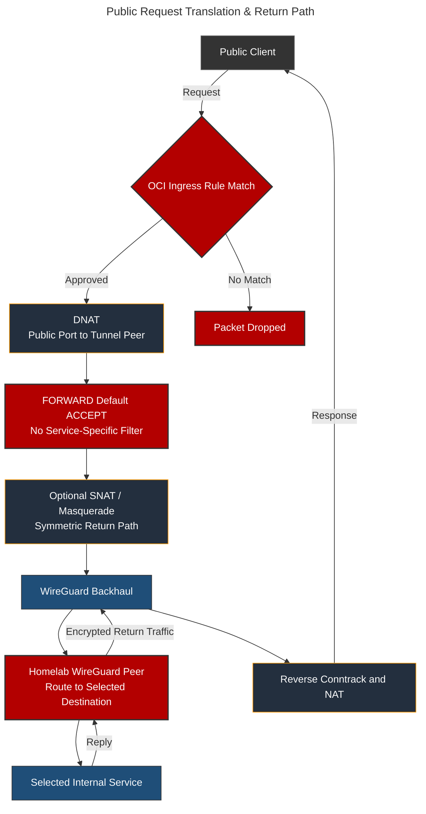

# Oracle Cloud Infrastructure: Public IPv4 Edge & WireGuard CGNAT Relay

## Overview & Purpose

The Oracle Cloud Infrastructure (OCI) instance provides a stable, publicly routable IPv4 ingress point for a selected homelab service that cannot be reached directly through the residential Carrier-Grade NAT (CGNAT) connection.

The instance operates as a Layer 3/Layer 4 relay rather than an application host. OCI policy and the host `INPUT` chain protect local listeners, while DNAT sends the selected public service through WireGuard. Forwarded traffic has a separate authorization boundary in the `FORWARD` chain. Application state and user data remain inside the homelab.

### Edge Relay Responsibilities

* Terminate the public side of the WireGuard tunnel.
* Limit cloud ingress and DNAT to explicitly published protocols.
* Keep forwarded-flow authorization separate from local-listener policy.
* Preserve a symmetric return path through the relay where source NAT is required.
* Remain independently patched, monitored, backed up, and recoverable as an internet-facing Linux system.

---

## Deployment Architecture

```mermaid
---
title: OCI Public IPv4 Ingress & WireGuard Relay
---
flowchart LR
    classDef cloud fill:#232F3E,stroke:#FF9900,color:#fff;
    classDef firewall fill:#b30000,stroke:#333,color:#fff,stroke-width:2px;
    classDef core fill:#1f4e78,stroke:#333,color:#fff;
    classDef net fill:#333,stroke:#666,color:#fff;

    Client["Public IPv4 Client"]:::net

    subgraph OCI["Oracle Cloud Infrastructure"]
        CloudPolicy["VCN Security Rules"]:::firewall

        subgraph VPS["OCI Edge Instance"]
            HostPolicy["Linux Netfilter Policy<br/>DNAT, SNAT, and Forwarding"]:::firewall
            WireGuard["WireGuard Interface<br/>Encrypted Relay Endpoint"]:::cloud
        end
    end

    CGNAT["Residential CGNAT"]:::net
    OPNsense["OPNsense<br/>NAT State and Encrypted UDP Transit"]:::firewall
    HomePeer["Homelab WireGuard Peer<br/>Behind CGNAT"]:::firewall
    Service["Selected Internal Service"]:::core

    Client -->|Published TCP / UDP Service| CloudPolicy
    CloudPolicy --> HostPolicy
    HostPolicy -->|Translated Traffic| WireGuard
    HomePeer -->|1. Outbound WireGuard Handshake<br/>and Persistent Keepalive| OPNsense
    OPNsense -->|2. Outbound UDP and NAT State| CGNAT
    CGNAT -->|3. UDP to Public Listener| WireGuard
    WireGuard -->|4. Encrypted Relay Traffic| CGNAT
    CGNAT -->|5. Established Return Flow| OPNsense
    OPNsense -->|6. Encrypted UDP Transit| HomePeer
    HomePeer -->|Route to Selected Destination| Service
```



### Packet Processing Path



OPNsense carries the encrypted UDP flow and maintains the residential NAT state. WireGuard decrypts the relayed service traffic on the homelab peer; host-local delivery after decryption does not traverse OPNsense again.

---

## Technical Configuration & Routing

The configurations below preserve the control flow of the deployment while replacing public addresses, tunnel prefixes, ports, interface names, peer keys, and internal destinations with placeholders.

### Kernel Forwarding

```ini
# /etc/sysctl.conf
net.ipv4.ip_forward = 1
```

IPv4 forwarding is required because the instance routes packets between its public interface and WireGuard. IPv6 forwarding is unnecessary unless the relay is intentionally routing IPv6 traffic as well.

### Sanitized WireGuard Configuration

```ini
# OCI edge instance: /etc/wireguard/wg0.conf
[Interface]
Address = <OCI_TUNNEL_ADDRESS>/24
SaveConfig = true
PrivateKey = <REDACTED_OCI_PRIVATE_KEY>
ListenPort = <WIREGUARD_UDP_PORT>

[Peer]
# Homelab peer
PublicKey = <REDACTED_HOMELAB_PUBLIC_KEY>
AllowedIPs = <HOMELAB_TUNNEL_ADDRESS>/32, <ROUTED_HOME_PREFIX>
Endpoint = <REDACTED_HOMELAB_ENDPOINT>
```

With `SaveConfig = true`, `wg-quick` writes runtime state back to the configuration when the interface shuts down. This can preserve a peer endpoint learned from an inbound handshake. The endpoint recorded on OCI therefore does not mean OCI established the tunnel first; the homelab still initiates toward OCI's public listener.

The corresponding homelab peer is configured with the publicly reachable OCI endpoint. **The homelab initiates the WireGuard connection to OCI**; OCI cannot initiate unsolicited connectivity through residential CGNAT. Once that outbound handshake creates the NAT mapping, OCI can carry public ingress traffic back over the established bidirectional tunnel.

The live configuration uses a persistent keepalive on the homelab peer so the upstream NAT mapping does not expire:

```ini
# Sanitized homelab-side peer configuration
[Interface]
PrivateKey = <REDACTED_HOMELAB_PRIVATE_KEY>
Address = <HOMELAB_TUNNEL_ADDRESS>/32, <ROUTED_HOME_PREFIX>
MTU = 1420

[Peer]
PublicKey = <REDACTED_OCI_PUBLIC_KEY>
Endpoint = <OCI_PUBLIC_ADDRESS>:<WIREGUARD_UDP_PORT>
AllowedIPs = <TUNNEL_PREFIX>
PersistentKeepalive = 21
```

`PersistentKeepalive` belongs on the homelab peer behind NAT, not on the publicly reachable OCI endpoint. The 21-second interval maintains the outbound UDP state needed for the edge node to return traffic through CGNAT.

`AllowedIPs` performs both route selection and peer-source authorization in WireGuard. On OCI, the homelab peer owns its tunnel address and the routed home prefix containing the selected destination. This is why the DNAT target is sent through `wg0` instead of OCI's normal default route.

### Netfilter Relay Path

The OCI host uses Netfilter to translate the selected public listener into the WireGuard path. The security boundary spans four separate operations:

```text
OCI ingress policy
    -> public service listener
    -> DNAT to the selected tunnel destination
    -> FORWARD-chain processing
    -> optional source NAT for a symmetric return path
    -> WireGuard backhaul
```

The exact active firewall export is excluded because it contains deployment-specific listener mappings, addresses, interface details, and rule ordering. `INPUT`, `FORWARD`, and NAT are separate processing paths: an `INPUT` rule protects services hosted on the OCI instance, while DNAT traffic must be evaluated through forwarding policy.

### Source NAT Trade-off

Masquerading makes return routing straightforward because the internal destination sees the connection as originating through the relay path. The trade-off is loss of the original client IP at the destination. Preserving the client address instead requires explicit return routing or policy routing through WireGuard.

### Rule Persistence

Runtime `iptables` commands disappear after a reboot unless restored by the operating system. The instance uses `netfilter-persistent` to save and restore the filter and NAT tables across reboots. Operational validation compares the restored rules and packet path after boot rather than assuming that service startup proves forwarding is correct.

```bash
sudo netfilter-persistent save
sudo netfilter-persistent reload
```

Recovery documentation retains the sanitized rule intent separately from live addresses and keys.

---

## Layered Security Model

### OCI Network Policy

OCI security lists or network security groups form the outer policy layer for the instance's VNIC. Only the WireGuard listener, explicitly published service ports, and the restricted management path are admitted. Stateful rules permit response traffic for established flows without opening unrelated ingress.

Cloud policy and the host firewall serve different enforcement points. OCI rules filter before traffic reaches the virtual machine, while Netfilter controls local listeners, forwarding, translation, and tunnel egress.

### Host Firewall & Relay Scope

Local listeners and forwarded flows use separate Netfilter paths. A published service therefore depends on agreement between OCI ingress policy, DNAT, `FORWARD` processing, WireGuard routing, and the homelab host policy. OPNsense handles encrypted UDP transit, not authorization of host-local traffic after WireGuard decryption.

The cloud node stores no application database or user content. It does, however, retain sensitive infrastructure material—WireGuard private keys, SSH authorization, firewall state, and cloud-instance configuration.

### WireGuard Backhaul

WireGuard authenticates each peer cryptographically and encrypts traffic across the public internet. The tunnel establishes network reachability, not blanket authorization. DNAT selects the intended destination, but the separate `FORWARD` policy must authorize only that flow. The homelab peer and host firewall remain independent controls after decryption.

### Administrative Access

SSH uses key-based authentication, with password and keyboard-interactive login disabled. The private key is stored in an encrypted password manager and is excluded from the repository and general-purpose shared storage.

A non-standard SSH port may reduce routine scanner noise, but it is not treated as a security control. Exposure is reduced through OCI and host firewall source restrictions, strong key handling, and an available provider-console recovery path.

### Maintenance Responsibility

The OCI node is a separate internet-facing Linux system and requires its own:

* Security updates and reboot planning
* Firewall and WireGuard configuration persistence
* SSH host-key and authorized-key management
* Log and resource review
* Tunnel and end-to-end service monitoring
* Recovery procedure for instance or boot-volume replacement

Automated security updates reduce patch delay but do not replace review of kernel reboots, configuration changes, or application-path validation.

---

## Security Rationale & Trade-offs

* **CGNAT traversal:** Provides conventional public IPv4 ingress without changing the residential ISP service.
* **Reduced cloud workload:** Keeps application state on-premises and limits the cloud node to routing and policy functions.
* **Layered enforcement:** The relay path spans OCI policy, Netfilter translation and forwarding, WireGuard routing, the homelab endpoint, and the destination service.
* **Additional attack surface:** Introduces a public Linux host, cloud account, SSH keys, WireGuard keys, and firewall configuration that must be maintained.
* **Source-address visibility:** SNAT simplifies routing but obscures the original client address from downstream systems.
* **Availability dependency:** Public access now depends on OCI, the edge instance, the tunnel, residential connectivity, the homelab WireGuard peer, and the origin application.

---

## Failure Modes & Resolution

### Common Failure Modes

| Failure Mode | Diagnostic Path | Resolution |
| --- | --- | --- |
| **Public endpoint unreachable** | Confirm instance state, OCI ingress policy, host listener, and Netfilter packet counters | Restore the failed cloud or host policy layer without broadening unrelated ingress |
| **WireGuard handshake absent** | Run `wg show` on OCI and the homelab peer; verify endpoint, keys, UDP reachability, and the latest handshake | Correct the peer configuration and re-establish the outbound NAT mapping from the homelab |
| **Handshake succeeds but no forwarded traffic** | Inspect `ip route`, `AllowedIPs`, `net.ipv4.ip_forward`, and FORWARD-chain counters | Restore forwarding, route selection, or the narrow service rule |
| **Relay policy does not match the intended service path** | Compare OCI ingress, DNAT, `FORWARD` processing, routes, and packet counters | Correct the mismatched layer and retest the published service in both directions before persisting the ruleset |
| **Request enters OCI but not the tunnel** | Capture on the public and WireGuard interfaces and compare DNAT/FORWARD counters | Correct the translation destination, interface, protocol, or rule order |
| **Tunnel traffic reaches the homelab peer but not the service** | Capture on the homelab WireGuard interface and test the selected destination locally | Correct home-side forwarding, firewall policy, routing, or the destination listener |
| **Replies leave through the residential WAN** | Compare captures on WireGuard and the normal WAN path | Restore SNAT or add the required policy route for preserved client addresses |
| **Rules disappear after reboot** | Compare active filter and NAT tables with the persisted firewall definition | Restore the saved rules and verify automatic loading during boot |
| **SSH access fails** | Use verbose SSH diagnostics, verify cloud and host management rules, then use the serial console if required | Restore the authorized key or policy and rotate credentials after suspected compromise |
| **Instance must be rebuilt** | Recreate cloud policy, host hardening, WireGuard, and persisted forwarding rules from recovery documentation | Validate the tunnel and external service path before returning the endpoint to use |
