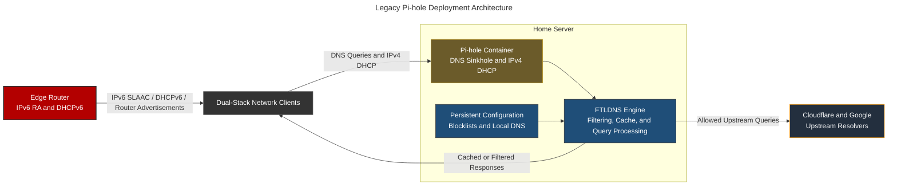
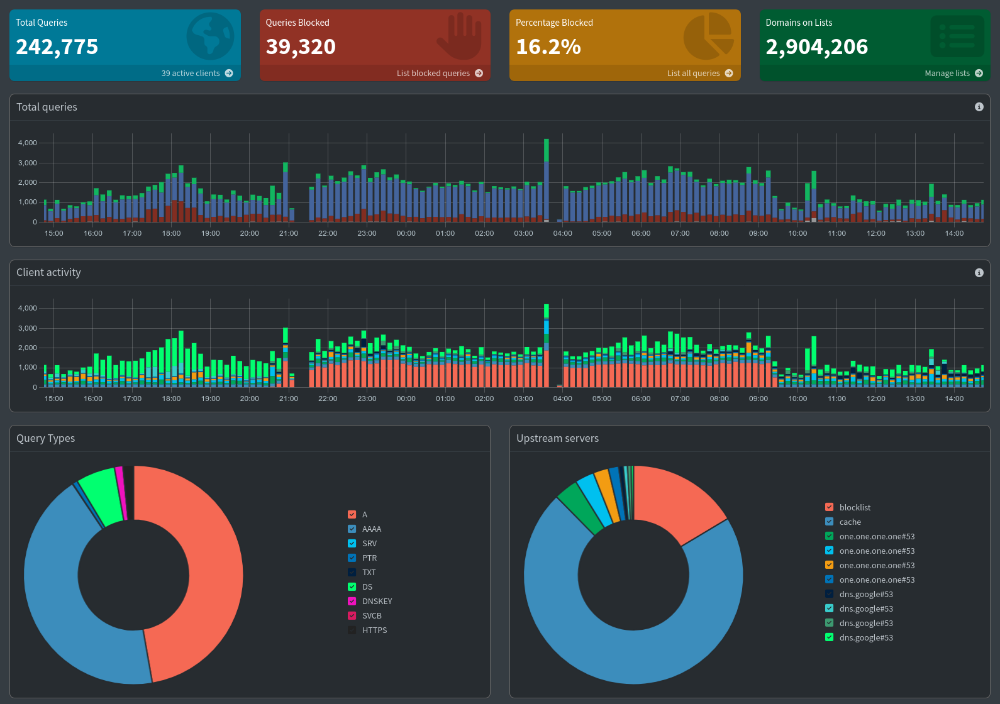
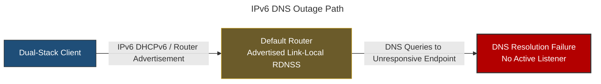

# Pi-hole: Centralized DNS Sinkhole & DHCP Engine

> [!NOTE]
> **Legacy Infrastructure Notice:** Pi-hole served as the primary DNS sinkhole and DHCP provider during the initial iterations of this homelab environment. In the current network topology, Pi-hole has been superseded by **OPNsense (running Unbound DNS and native DHCP/SLAAC services)** to centralize perimeter routing and DNS filtering into a single firewall appliance.

## Overview & Purpose

Pi-hole served as the default DNS resolver and IPv4 DHCP service for the home lab. Its filtering policy blocked configured advertising, tracking, and malicious domains before clients attempted connections to those destinations.

### Core Engine Architecture: FTLDNS

Pi-hole uses **FTLDNS (Faster Than Light DNS)**, which embeds `dnsmasq`-based DNS and DHCP functions with filtering, caching, and query telemetry. Runtime query state is held in memory, while long-term query data and configuration persist in SQLite-backed storage.

* **Filtering:** Evaluates exact, wildcard, and regular-expression policies before forwarding allowed queries.
* **Caching:** Reuses responses until their DNS time-to-live expires, reducing repeated upstream lookups.
* **DNSSEC:** Can validate signed DNS responses when enabled, rejecting responses that fail validation.

---

## Deployment Architecture



### Operational View



*Pi-hole telemetry demonstrates network-wide DNS filtering and resolver activity*

### Docker Container Configuration

```yaml
services:
  pihole:
    container_name: pihole
    image: pihole/pihole
    environment:
      TZ: <TIMEZONE>
    volumes:
      - <PIHOLE_CONFIGURATION_PATH>:/etc/pihole
    cap_add:
      - NET_ADMIN
      - SYS_NICE
    network_mode: host
    restart: unless-stopped
    shm_size: 128m
```

#### Deployment Rationale

* **`NET_ADMIN`:** Grants permission to manipulate host network interfaces, ARP tables, and bind raw sockets required for DHCP address distribution.
* **`SYS_NICE`:** Allows FTLDNS to adjust process scheduling priorities to prevent query dropouts under high host CPU utilization.
* **`network_mode: host`:** Gives DNS and DHCP direct access to host interfaces. This avoids Docker port translation for DHCP broadcasts but makes every non-loopback listener part of the host attack surface.

> [!NOTE]
> **Network Mode & Scope Note:**
> Pi-hole was configured for IPv4 DHCP distribution only. IPv6 network auto-configuration (DHCPv6 / SLAAC / Router Advertisements) remained entirely delegated to the default edge router.

---

### Upstream DNS Strategy & Security Protocol Stack

Pi-hole routes un-cached upstream DNS queries using a dual-stack (IPv4/IPv6) multi-provider architecture:

1. **Cloudflare Upstream:**
* **IPv4:** `1.1.1.1` / `1.0.0.1`
* **IPv6:** `2606:4700:4700::1111` / `2606:4700:4700::1001`
* **Features:** Built-in DNSSEC validation.

2. **Google Upstream:**
* **IPv4:** `8.8.8.8` / `8.8.4.4`
* **IPv6:** `2001:4860:4860::8888` / `2001:4860:4860::8844`
* **Features:** Built-in DNSSEC validation.

---

> [!IMPORTANT]
> **Upstream Resolver Selection Behavior:**
>
> Declaring multiple upstream DNS servers does not create fixed round-robin load balancing. FTLDNS favors the fastest responsive upstream and periodically reevaluates that choice:
>
> 1. FTLDNS measures responses from configured upstream servers.
> 2. The fastest responsive server is preferred for up to 1,000 queries or 10 minutes, whichever occurs first.
> 3. Periodic probes allow another upstream to become preferred, while timeouts trigger earlier failover.
>
> Traffic may therefore be unevenly distributed even when several upstream resolvers are configured.

---

#### Cryptographic & Operational Mechanisms

* **DNSSEC (Domain Name System Security Extensions):** Validates signatures for DNSSEC-signed zones against the chain of trust. Responses that are cryptographically bogus fail validation; unsigned zones remain valid but unauthenticated.

---

### Managed Blocklists

To maintain high precision without breaking legitimate web applications, the sinkhole aggregates the following feeds:

| Feed Name | Focus / Threat Domain | Format |
| --- | --- | --- |
| **StevenBlack Hosts** | Unified baseline ad/malware feed | `hosts` file syntax |
| **HaGezi Pro** | Aggressive ad, tracking, and telemetry suppression | Domain list |
| **HaGezi Popup Ads** | Malvertising & intrusive popups | Domain list |
| **HaGezi Threat Intelligence (TIF)** | High-confidence phishing, malware, C2, and scam domains | Domain list |
| **OISD NSFW** | Explicit content domain sinkhole | Domain list |

---

## Security Rationale & Trade-offs

### Sinkhole Response Mode: `NULL` Block (RFC 1122 / RFC 4291)

Pi-hole is configured to use the **`NULL` blocking mode**, returning `0.0.0.0` (for IPv4) or `::` (for IPv6) when a blocked domain is queried.

* **Compared with `NXDOMAIN`:** NULL blocking returns an unusable address rather than asserting that the queried name does not exist. Client behavior differs, so neither response is universally superior.
* **Compared with IP Redirection:** Returning an internal block-page address causes HTTPS clients to encounter a certificate-name mismatch. NULL blocking avoids that redirect path.
* **Standards behavior:** `0.0.0.0` and `::` are unspecified addresses. Most clients fail the subsequent connection locally instead of waiting for a remote block-page service.

### Security Trade-offs

* **Central Point of Failure:** If the container or host crashes, all downstream network resolution fails unless secondary internal resolvers are defined.
* **False Positives:** Aggressive feeds (e.g., HaGezi Pro) can break affiliate marketing links, single sign-on (SSO) redirects, or app-level telemetry required for functional rendering. Whitelisting rules must be maintained continuously.

---

## Failure Modes, Incidents, and Resolution

### Common Failure Modes

| Failure | Diagnostic Path | Resolution |
| --- | --- | --- |
| DNS resolution unavailable | Test direct IP connectivity, query Pi-hole explicitly, and inspect FTLDNS and container health | Restore the DNS listener or container before renewing client resolver state |
| DHCP leases not issued | Check the active DHCP authority, interface binding, lease database, and `NET_ADMIN` capability | Restore the intended DHCP service and renew affected client leases |
| Legitimate domain blocked | Review the query log, matched blocklist entry, and any dependent domains | Add the narrowest required allowlist entry and retest the complete application flow |
| Upstream resolution failure | Query each configured resolver directly and check DNSSEC-related `SERVFAIL` responses | Remove or correct the failed upstream and confirm validated resolution through Pi-hole |
| Configuration lost after recreation | Verify the `/etc/pihole` bind mount and host filesystem permissions | Restore the persistent configuration before rebuilding blocklists and local records |
| IPv4 works while IPv6 DNS fails | Compare DHCPv4 DNS settings with IPv6 RDNSS information distributed through Router Advertisements | Point both address families to active resolvers and renew client network state |

### Incident Post-Mortem: Complete IPv6 DNS Outage via Default Router WAN/RA Settings

#### Incident Summary

During the initial Pi-hole deployment, dual-stack network clients suddenly lost all domain name resolution. Hostname resolution failed completely across client devices (resulting in connection timeouts), while direct IP connectivity (e.g., `ping 1.1.1.1` or browsing to a direct IP address) remained fully functional. Network diagnostics revealed that clients were attempting to route IPv6 DNS queries to the router's default interface/WAN configuration, where no local filtering DNS listener was active.

#### Root Cause Analysis (RCA)

While IPv4 DHCP allocation was successfully managed by Pi-hole, dual-stack IPv6 network autoconfiguration remained handled by the default router using **DHCPv6 and Router Advertisements (RA)** (RFC 4861).

The router's default IPv6 DNS settings were left on **"Auto / WAN Configuration"**. As a result, Router Advertisements supplied the router's link-local address as the Recursive DNS Server (RDNSS). Clients selected that advertised IPv6 resolver even though no functional DNS service was listening there, causing DNS resolution to fail across the network.



#### Diagnostic Process

1. **Layer 3 Connectivity Check:** Executed `ping 1.1.1.1` (IPv4) and `ping 2606:4700:4700::1111` (IPv6). Direct IP routing was functional, proving gateway interfaces and physical layers were up.
2. **DHCPv4 Scoping Verification:** Executed `ipconfig /renew` (Windows) / `dhclient -v` (Linux). Confirmed that Pi-hole was correctly issuing IPv4 parameters and setting itself as the IPv4 DNS target.
3. **IPv6 DNS Query Path Tracing:** Executed `nslookup target-domain.com`. Identified that queries failed because client network stacks defaulted to the router's unconfigured IPv6 DNS target:

```bash
# Diagnostic command revealing non-responsive IPv6 DNS server:
nslookup doubleclick.net
# Output showed:
Server:  UnKnown
Address: <ROUTER_LINK_LOCAL>%<ZONE_ID>  # No active DNS response

```

#### Remediation & Resolution

1. **Router IPv6 DNS Override:** Navigated to the default router's IPv6 LAN / Router Advertisement settings.
2. **WAN Config to Static Pi-hole Pointer:** Changed the IPv6 DNS option from *WAN Configuration / Auto* to **Static**, explicitly inputting the **Pi-hole server's IPv6 Link-Local address (`fe80::...`)**.
3. **Validation:** Flushed client DNS caches (`ipconfig /flushdns` / `resolvectl flush-caches`) and renewed interface leases. Verified via `nslookup` that IPv6 queries were now successfully arriving at Pi-hole's IPv6 interface, resolving hostnames correctly and restoring dual-stack network functionality.
