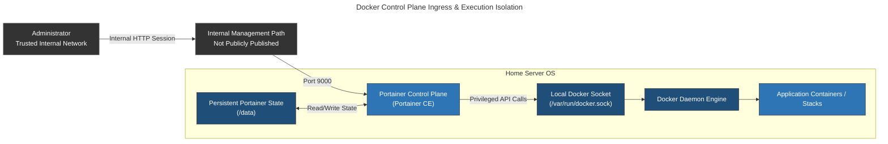

# Portainer: Centralized Container Management

## Overview & Purpose

Portainer provides the administrative control plane for Docker workloads running on the home server. It offers a centralized interface to deploy Compose stacks, inspect container state, review operational logs, manage isolated bridge networks, and execute container lifecycle actions.

Portainer runs in a separate Compose project from the application stacks. If its interface is unavailable, existing application containers continue running, but graphical administration is temporarily unavailable.

### Control Plane & Trust Boundary

Because Portainer interacts directly with the local Docker API socket (`/var/run/docker.sock`), it possesses host-equivalent administrative privileges. Access to the Portainer web panel must be treated with the same security controls as `root` SSH access to the host operating system.

---

## Deployment Architecture



### Docker Container Configuration

```yaml
services:
  portainer:
    container_name: portainer
    image: portainer/portainer-ce
    ports:
      - "9000:9000"
    volumes:
      - /var/run/docker.sock:/var/run/docker.sock
      - <HOST_PATH>/portainer-data:/data
      - <HOST_PATH>/docker-builds:/docker-builds
    restart: always

```

* Persistent state—including users, authentication state, endpoint metadata, and Portainer-managed stack definitions—is stored outside the container through `/data`.
* Only the legacy HTTP listener on port `9000` is published. Port `9443` is not published; network policy is configured to keep the HTTP listener on the trusted internal management path rather than public ingress.

> [!IMPORTANT]
> Keeping Portainer private reduces exposure, but it does not make cleartext HTTP equivalent to HTTPS. Credentials and session data on port `9000` are not transport-encrypted. This is an accepted homelab trade-off based on the current trusted-network boundary—not a claim that TLS is unnecessary for every non-public deployment. If access expands to guest Wi-Fi, an untrusted VLAN, remote ingress, or a shared network, TLS should be enabled directly on `9443` or terminated through a trusted reverse proxy.

---

## Stack Management Model

### Declarative Compose Integration

Portainer provides a control surface for Docker Compose stacks. Service definitions—including images, mounts, networks, environment references, restart policies, and health checks—can be submitted through the web editor. Portainer-managed definitions and control-plane state depend on the persistent `/data` mount, so that directory is included in backup and recovery planning.

### Docker Engine Interfacing

The container communicates locally via `/var/run/docker.sock`. Inter-process communication across the socket avoids network overhead and eliminates network-exposed TCP socket attack vectors (`0.0.0.0:2375`).

---

## Security Rationale & Threat Model

| Risk Vector | Threat Analysis | Mitigation / Hardening Strategy |
| --- | --- | --- |
| **Docker Socket Compromise** | Code execution inside Portainer can translate into privileged Docker API operations and host-level impact. | Restrict panel access to the internal management path, use strong administrator credentials, keep Portainer updated, and treat `/data` and the socket as privileged assets. |
| **Cleartext Internal HTTP** | Port `9000` does not encrypt administrator credentials or session traffic. | Keep it off public ingress and untrusted segments. Enable `9443` or trusted reverse-proxy TLS if the access boundary expands. |
| **Configuration Divergence** | Manual stack changes in the UI can diverge from separately maintained Compose files. | Keep recoverable canonical definitions and review the deployed stack before destructive updates or recreation. |
| **Persistent-State Loss** | Loss of `/data` removes Portainer users, endpoint metadata, and Portainer-managed stack definitions even though running containers may continue. | Back up the Portainer data mount and retain independent copies of important Compose definitions and environment files. |

---

## Failure Modes & Resolution

### Common Failure Modes

| Failure Mode | Diagnostic Procedure | Remediation Action |
| --- | --- | --- |
| **Socket Permission Denied** | Inspect container logs: `docker logs portainer`. Check host socket permissions (`ls -la /var/run/docker.sock`). | Ensure socket group ownership matches container access requirements or verify host daemon initialization state. |
| **Lost Administrator Credentials** | Confirm that the correct persistent `/data` volume is mounted and review the login failure | Use Portainer's documented password-reset helper against `<PORTAINER_DATA_PATH>:/data` without deleting the existing state |
| **Portainer Container Stops** | Inspect `docker ps -a`, `docker logs portainer`, and the container exit state | Correct the reported startup or resource failure, then recreate Portainer without disturbing managed application containers |
| **Portainer State Corrupted or Missing** | Confirm the `/data` mount, permissions, and startup logs before assuming the database is damaged | Stop Portainer, restore the complete data directory from backup, and restart the control plane |
| **Container Stack Drift** | Running container configuration does not match source file definitions. | Pull updated definitions, select **Re-deploy** in Portainer with the *Re-pull image* toggle enabled, or redeploy manually via host CLI (`docker compose up -d --force-recreate`). |
