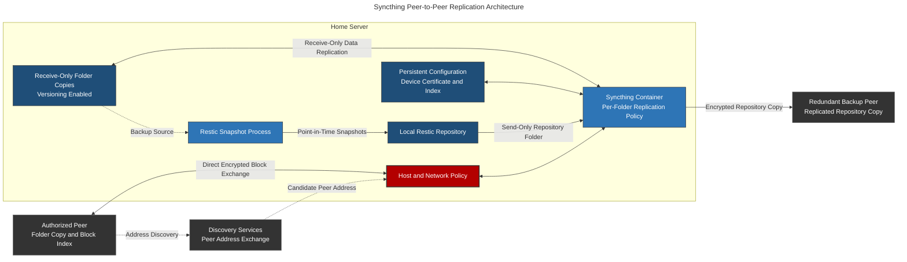

# Syncthing: Encrypted Peer-to-Peer File Synchronization

## Overview & Purpose

Syncthing provides continuous peer-to-peer file synchronization between the home server and explicitly authorized devices. It exchanges changed file blocks directly between peers rather than storing the synchronized dataset in a third-party cloud service.

Each device maintains its own copy of shared folder data and its own synchronization index. The deployment deliberately uses asymmetric folder roles: source devices publish data through **Send Only** folders, while the home server uses **Receive Only** folders for protected replicas. The home-server configuration currently contains four Receive Only data folders, one Send & Receive folder, and a separate Send Only folder for replication of the local Restic repository. Syncthing file versioning retains replaced or deleted files until the configured cleanup policy expires.

Syncthing also forms the replication layer for Restic backup data. Restic writes snapshots to a local repository, and Syncthing copies that repository to another device for an additional redundant copy. Restic provides point-in-time snapshot semantics; Syncthing transports the resulting repository between devices.

### Synchronization Model

* **Device Identity:** Each installation generates a certificate-backed Device ID used for peer authentication and authorization.
* **Per-folder authorization:** Trusting a device does not automatically grant it every folder; each share is assigned separately to selected peers.
* **Block Exchange:** Files are divided into blocks so peers can transfer only missing or changed content.
* **Conflict Handling:** Concurrent edits are preserved as conflict copies rather than silently overwriting both versions.
* **Transport Security:** Direct peer traffic remains encrypted end to end between authorized devices.

---

## Deployment Architecture



The deployment uses direct encrypted connections between authorized peers. LAN and global discovery help peers locate one another but do not store synchronized file contents. Relay fallback and automatic NAT traversal are disabled.

### Docker Container Configuration

```yaml
services:
  syncthing:
    container_name: syncthing
    image: syncthing/syncthing
    environment:
      PUID: "<HOST_UID>"
      PGID: "<HOST_GID>"
    volumes:
      - <SYNCTHING_CONFIG_PATH>:/var/syncthing/config
      - <SYNCHRONIZED_DATA_PATH>:/var/syncthing/data
    network_mode: host
    restart: unless-stopped
    init: true
    healthcheck:
      test:
        - CMD-SHELL
        - >-
          curl -fkLsS -m 2
          127.0.0.1:<SYNCTHING_GUI_PORT>/rest/noauth/health |
          grep -q OK
      interval: 1m
      timeout: 10s
      retries: 3
```

> **Deployment rationale:**
> * **Persistent configuration:** `/var/syncthing/config` contains the device certificate, private key, peer and folder definitions, and index database. Losing this state changes the device identity and requires peers to authorize the replacement device.
> * **Separate synchronized data:** Folder contents persist independently from the container image and can be restored or inspected from the host.
> * **Host networking:** Avoids separate Docker mappings for the GUI, discovery, and synchronization listeners. It also makes every non-loopback Syncthing listener part of the host attack surface.
> * **Host UID/GID mapping:** Aligns container writes with ownership on the synchronized host paths.
> * **Health check:** Confirms that Syncthing's local health endpoint responds. It does not prove that remote peers are connected or that every folder is synchronized.

---

## Peer, Discovery & Folder Model

### Device Identity and Authorization

A Device ID is derived from a device's certificate and identifies the key used during connection setup. A peer must be explicitly added, and a folder must then be shared with that peer. Possession of a Device ID alone is not sufficient to join the synchronization relationship.

The configuration directory is security-sensitive. Access to its certificate and private key can allow another system to impersonate that Syncthing device. Device IDs should also be treated as infrastructure identifiers because global discovery can associate them with reachable addresses.

### Connection Establishment

Syncthing can establish peer connectivity through several paths:

1. Local discovery identifies peers on the same network.
2. Global discovery maps a Device ID to candidate network addresses when enabled.
3. Statically configured addresses can bypass discovery for known routes.
4. NAT traversal may establish a direct path where the surrounding network permits it.
5. A relay transports the encrypted connection when peers cannot connect directly.

Discovery and relay services receive metadata such as device identifiers and network addresses. They do not receive the decrypted synchronized payload, but their metadata exposure remains a privacy trade-off.

### Folder State and Integrity

Each device maintains a local index describing file names, sizes, modification state, permissions where supported, and block hashes. Peers compare index information and request only the blocks needed to converge.

Folder roles determine how local and remote changes are handled:

| Folder Type | Behavior | Operational Use |
| --- | --- | --- |
| **Send & Receive** | Local and remote changes propagate in both directions | Collaborative folders where each peer may modify content |
| **Send Only** | Local state is authoritative; remote changes are reported as overrides | Used by the source peers that publish folder state to the home server |
| **Receive Only** | Remote changes are accepted while local divergence is reported | Used by the home server as the protected replication destination |

This role separation reduces the risk of an unintended home-server change being treated as authoritative and propagated back to the source. It does not make the replica immutable: an administrator can still override local changes, and compromised source data can still arrive as a legitimate update.

File versioning is enabled so replaced and deleted files can be recovered from the opposite peer before trash cleanup removes the retained version. The effective recovery window depends on the selected versioning type, retention parameters, available storage, and cleanup schedule.

### Sanitized Active Folder Policy

The Restic repository is exposed to Syncthing as a dedicated Send Only folder with one remote peer.

```xml
<folder id="REDACTED_FOLDER_ID"
        path="SANITIZED_CONTAINER_REPOSITORY_PATH"
        type="sendonly"
        rescanIntervalS="3600"
        fsWatcherEnabled="true"
        fsWatcherDelayS="10"
        ignorePerms="false">
  <versioning type="simple">
    <param key="cleanoutDays" val="7"/>
    <param key="keep" val="1"/>
    <cleanupIntervalS>3600</cleanupIntervalS>
  </versioning>
  <device id="REDACTED_LOCAL_DEVICE_ID"/>
  <device id="REDACTED_REMOTE_DEVICE_ID"/>
</folder>
```

The other active folders predominantly use Receive Only mode. Simple versioning generally retains one prior version for seven days; one Receive Only folder extends cleanup to 15 days. These settings provide a bounded recovery window rather than indefinite retention.

### Ignore Rules

`.stignore` rules prevent selected paths from participating in synchronization. They are useful for caches, transient files, application locks, and platform-specific metadata. Ignore rules must be tested carefully: excluding an application database or sidecar metadata can create a replica that appears complete but cannot be restored consistently.

---

## Security Rationale & Trade-offs

### Management Interface

The Web UI controls device trust, folder sharing, API access, and filesystem paths. In the active configuration it uses non-TLS HTTP and listens on all IPv4 interfaces. With host networking, this makes surrounding host and network policy—not Docker port publication—the primary exposure boundary.

The GUI should remain restricted to trusted management paths and protected with authentication. If accessed across an untrusted network, transport encryption or a secured VPN path is required.

### Replication Is Not Backup

Syncthing improves data availability across devices, but writable peers share failure modes:

* Accidental deletion can replicate.
* Ransomware-encrypted content can replicate.
* Application-level corruption can replicate.
* A compromised authorized peer can alter shared data.
* File versioning can be exhausted or lost with the device storing it.

The deployment combines two mechanisms:

* **Asymmetric Syncthing replication:** Send Only source peers replicate into Receive Only folders on the home server, with file versioning for short-term recovery of replaced or deleted files.
* **Restic snapshots:** Restic writes point-in-time backups to a local repository, which Syncthing then copies to another device for redundancy.

This is a valid backup design, but the replicated Restic repository is still one logical backup set. Repository corruption or deletion can also be synchronized, so recovery confidence depends on Restic integrity checks, repository credentials, retention policy, and whether the second copy can be protected from immediate destructive propagation.

### Peer Trust and Least Privilege

Only required folders are shared with each device. Where a peer should consume but not author data, `Receive Only` or `Send Only` roles reduce accidental bidirectional changes, although they do not replace filesystem permissions or endpoint security.

### Host-Network Exposure

Host networking simplifies peer connectivity but removes Docker port-publication boundaries. Global discovery and LAN discovery are enabled, while relay transport and automatic NAT traversal are disabled. Peer addresses remain dynamic. This favors direct peer connections and discovery-assisted address resolution without opening mappings automatically or falling back to public relays.

---

## Restic Backup & Repository Replication

Restic runs independently from the Syncthing container through a privileged systemd oneshot service and timer. It writes to a local repository; Syncthing then replicates that repository to one remote peer through the dedicated Send Only folder.

### Scheduling & Consistency Model

| Operation | Schedule | Behavior |
| --- | --- | --- |
| **Backup** | Daily at 03:30 local server time | Acquires a non-blocking lock, records recovery metadata, stops running containers for a cold-consistent snapshot, and restarts the previously running set through an exit trap |
| **Integrity Check** | Sunday at 06:30 local server time | Verifies repository packs, snapshots, trees, and blobs |

Both timers are non-persistent, so a run missed while the server is offline is not automatically replayed at boot. Service output and failures are retained in the system journal.

The backup excludes the repository itself, cache and temporary data, and Docker runtime/image layers. `--exclude-caches` is also enabled. Retention is enforced with:

```bash
restic forget --prune \
  --keep-daily 14 \
  --keep-weekly 8 \
  --keep-monthly 12
```

---

## Failure Modes & Resolution

### Common Failure Modes

| Failure Mode | Diagnostic Path | Resolution |
| --- | --- | --- |
| **Peer disconnected** | Check `syncthing` logs, the peer's last-seen state, candidate addresses, and direct-versus-relay connection status | Correct routing, firewall policy, discovery, or the configured static address without replacing a valid device identity |
| **Device rejected or unexpected identity** | Compare the presented Device ID with the independently verified peer identity | Reject unknown devices; if a legitimate peer was rebuilt, authorize its new identity and remove the obsolete one |
| **Folder remains out of sync** | Inspect failed items, folder error state, free space, and filesystem permissions on both peers | Correct the specific path, ownership, conflict, or capacity problem and rescan the folder |
| **Permission denied** | Review container logs and compare host ownership with the configured UID/GID | Restore ownership and access only on the intended synchronized path; avoid broad recursive permission changes without reviewing the dataset |
| **Index database unavailable** | Confirm configuration storage health and inspect startup errors before resetting state | Stop Syncthing, back up the configuration directory, then use the supported database-reset procedure and allow a controlled re-index |
| **Deletion or corruption propagates** | Pause the affected folder on all reachable peers and identify the earliest affected state | Restore from configured file versioning or an independent backup; do not resume synchronization until the clean source is established |
| **Conflict files accumulate** | Identify peers making concurrent changes and inspect each `.sync-conflict-*` copy | Reconcile content manually and change folder workflow or ownership to prevent repeated concurrent writes |
| **Container reports healthy but peers are stale** | Compare the health endpoint with per-peer connection and folder completion state | Treat container health as process readiness only and repair the failed peer or folder path separately |
