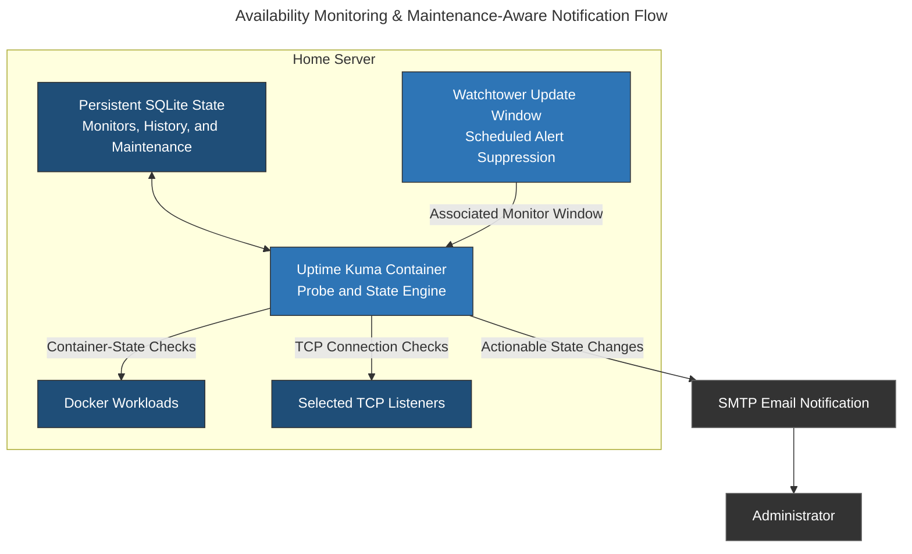

# Uptime Kuma: Service Availability Monitoring & Maintenance-Aware Alerting

## Overview & Purpose

Uptime Kuma provides centralized service-availability monitoring for the homelab. It continuously evaluates Docker workload state and selected network listeners, records availability history, and sends email notifications when configured state transitions require attention.

The deployment has a deliberately narrow role within the observability stack:

* **Uptime Kuma:** Answers whether a monitored service or listener is available from the monitoring host.
* **Glances:** Supplies host and container resource telemetry such as CPU, memory, storage, network, and sensor state.
* **Application Logs:** Explain service-specific failures after an availability problem has been detected.

A successful probe establishes only the condition tested by that monitor. Docker state does not prove that an application is usable, and an open TCP listener does not prove that its protocol or downstream dependencies are healthy.

---

## Deployment Architecture



### Docker Deployment Boundary

The active Uptime Kuma state is stored in a bind-backed `/app/data` directory using SQLite. This persistent state includes monitor definitions, historical measurements, maintenance schedules, user state, and notification configuration.

```yaml
services:
  uptime-kuma:
    image: louislam/uptime-kuma
    container_name: uptime-kuma
    restart: always
    volumes:
      - <UPTIME_KUMA_DATA_PATH>:/app/data
    environment:
      - UMASK=0022
    network_mode: host
    healthcheck:
      test: ["CMD", "curl", "-f", "http://localhost:<UPTIME_KUMA_UI_PORT>"]
      interval: 30s
      retries: 3
      start_period: 10s
      timeout: 5s
    logging:
      driver: "json-file"
      options:
        max-size: "10m"
        max-file: "3"
```

Host networking removes Docker's port-publication boundary. Dashboard access therefore depends on the application's listen address and host network policy. The health check confirms only that the local web process responds; it does not verify monitor execution or notification delivery.

---

## Active Monitor Strategy

The active database contains 22 monitors:

| Monitor Type | Count | Operational Purpose |
| --- | ---: | --- |
| **Docker** | 17 | Tracks configured container runtime state from the monitoring system |
| **TCP / Port** | 3 | Confirms that selected network listeners accept connections |
| **Group** | 2 | Organizes related monitors in the dashboard and notification workflow |

All active monitors use a 60-second normal interval and a 60-second retry interval. Retry counts differ by monitor—either zero or three—allowing selected services to tolerate transient failures before a down state is confirmed.

### Probe Semantics

#### Docker Monitors

Docker monitors provide fast visibility into workload state, but their result is bounded by what the Docker integration reports. A running or healthy container can still serve invalid responses, fail a downstream dependency, or be unreachable from another network segment.

#### TCP Monitors

TCP monitors verify listener reachability. They are appropriate for services where accepting a connection is the relevant first-level signal, but they do not validate application content or authentication behavior.

#### Groups

Groups organize monitors and help maintenance policies target a specific operational set. They do not create an additional probe or availability signal.

---

## Watchtower Maintenance Schedule

Automated container updates can stop and recreate workloads briefly even when the update succeeds. Without planned maintenance, those expected transitions appear identical to unplanned outages and generate unnecessary email notifications.

Uptime Kuma therefore contains an enabled, recurring **Watchtower Updates** maintenance window:

* Uses a cron-based recurrence.
* Lasts 30 minutes.
* Applies to the monitor associated with the Watchtower update cycle.
* Does not apply to a public status page.

During this window, Uptime Kuma places one associated update-related monitor into maintenance handling so its planned transition does not generate an ordinary outage notification. The other workload monitors are not covered by this maintenance entry. The schedule reduces alert noise; it does not stop Watchtower, initiate updates, or prove that updates succeeded.

This is a narrow alerting control, not a blanket suppression period for every container that Watchtower may recreate.

---

## Notification Model

One SMTP/email notification integration is configured. Notification destinations and credentials are excluded from the repository.

The notification path is intentionally state-based:

1. Uptime Kuma evaluates a monitor at its configured interval.
2. Retry policy determines whether a transient failure becomes a confirmed down state.
3. Maintenance state is evaluated for the associated monitor.
4. A qualifying transition is sent through the SMTP notification channel.
5. Recovery produces the corresponding state update after the target becomes available again.

Maintenance windows and retry policy solve different problems. Retries absorb short, unexpected probe failures; maintenance classifies a known interruption as planned.

---

## Security Rationale & Trade-offs

### Monitoring Control Plane

Uptime Kuma can reveal internal service names, container state, availability history, and notification configuration. Its persistent database is therefore sensitive operational state even when it does not contain application data.

### Notification Credentials

SMTP configuration introduces credentials and recipient metadata into the monitoring control plane. The database and its backups must be protected accordingly.

### Monitoring Blind Spots

The monitor inventory is intentionally dominated by Docker state checks. This provides broad workload visibility with low configuration overhead, but it can miss application-level failures. Critical services should use a protocol-aware monitor when the response body, status code, DNS result, or certificate state matters more than container state alone.

### Maintenance Scope

A maintenance window must be limited to the monitors genuinely affected by the planned operation. A broad window can suppress unrelated failures, while a schedule that does not match Watchtower's actual execution time still produces false alerts. Maintenance configuration and update timing must therefore remain aligned.

### Persistent State

SQLite database, WAL, and SHM files form a consistency set while the application is active. Backup procedures should capture the data directory consistently rather than copying only `kuma.db` while writes are in progress.

---

## Failure Modes & Resolution

### Common Failure Modes

| Failure Mode | Diagnostic Path | Resolution |
| --- | --- | --- |
| **Docker monitor reports unknown or down state** | Confirm Uptime Kuma's Docker connection, target container identity, and current Docker state | Restore the Docker integration or correct the monitor's container association before changing alert thresholds |
| **TCP monitor fails while container is running** | Test the listener from the Uptime Kuma network context and inspect the target service logs | Restore the listener, routing, or firewall path; do not treat container state alone as service availability |
| **Transient failures generate noisy email** | Compare monitor interval, retry count, and observed outage duration | Apply a bounded retry policy appropriate to the service rather than globally delaying all alerts |
| **Watchtower update generates an outage email** | Compare Watchtower's actual execution time with the maintenance recurrence, duration, and monitor association | Align the maintenance window with the update cycle and associate only affected monitors |
| **Real failure occurs during maintenance** | Review target logs and monitor history after the window ends | Repair the service and narrow or shorten maintenance if its scope masked unrelated failure |
| **Email notification is not delivered** | Use Uptime Kuma's notification test, then inspect SMTP connectivity and application logs | Correct SMTP credentials, DNS, transport, or provider policy without exposing secrets in logs or configuration exports |
| **Monitoring history or configuration disappears** | Verify the persistent `/app/data` mount and inspect SQLite startup errors | Stop the application, preserve the complete data directory, and restore from a consistent backup |
| **Dashboard is reachable but monitors stop updating** | Compare the latest heartbeat timestamps with container logs and database health | Restore the probe scheduler or database state; dashboard availability does not prove active monitoring |
