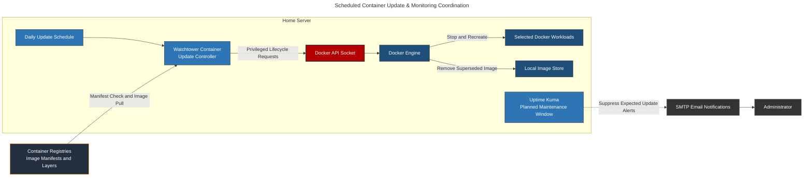
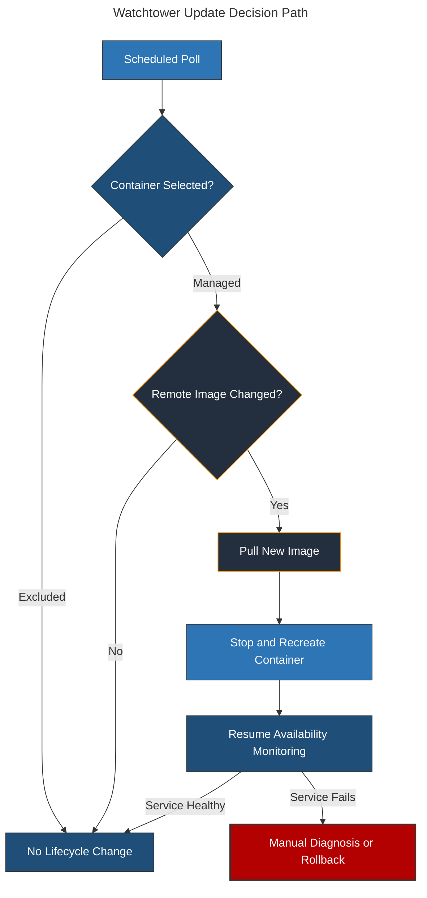

# Watchtower: Scheduled Container Image Updates & Lifecycle Automation

## Overview & Purpose

Watchtower automates routine image-update checks for Docker workloads on the home server. At the configured maintenance time, it compares the images used by running containers with their upstream registry references, pulls changed images, and recreates affected containers through the Docker API.

The deployment reduces manual update work, but it does not turn upstream releases into risk-free changes. Mutable image tags can introduce incompatible configuration, database migrations, or application regressions. Watchtower is therefore treated as a privileged maintenance mechanism with a defined schedule, persistent-data prerequisites, monitoring coordination, and manual recovery procedures.

### Operational Boundaries

* **Watchtower:** Detects changed images and recreates selected containers.
* **Docker:** Retains each container's runtime configuration and performs lifecycle operations.
* **Uptime Kuma:** Places one associated update-related monitor into maintenance handling; workload monitors continue under their own policies.
* **Restic:** Creates point-in-time backups independently of Watchtower.
* **Administrator:** Reviews failures and performs rollback; Watchtower does not provide automatic rollback.

---

## Deployment Architecture



### Sanitized Container Configuration

```yaml
services:
  watchtower:
    container_name: watchtower
    image: nickfedor/watchtower
    volumes:
      - /var/run/docker.sock:/var/run/docker.sock
    environment:
      WATCHTOWER_SCHEDULE: "0 0 1 * * *"
      WATCHTOWER_CLEANUP: "true"
      WATCHTOWER_HTTP_API_PERIODIC_POLLS: "true"
      WATCHTOWER_HTTP_API_METRICS: "true"
      WATCHTOWER_HTTP_API_UPDATE: "true"
      WATCHTOWER_HTTP_API_TOKEN: "<REDACTED>"
      WATCHTOWER_EPHEMERAL_SELF_UPDATE: "true"
    restart: unless-stopped
```

The deployment schedules one run each day at 01:00 using Watchtower's six-field cron syntax.

> [!IMPORTANT]
> The configuration does **not** enable `WATCHTOWER_LABEL_ENABLE`. Watchtower therefore uses broad default selection rather than requiring every managed container to opt in. Individual workloads can be excluded with `com.centurylinklabs.watchtower.enable=false`. This distinction matters: a `true` label does not create opt-in-only behavior unless global label-enable mode is also enabled.

---

## Update Lifecycle & Execution Model

### Scheduled Workflow

1. **Enumerate candidates:** Watchtower reads running container definitions through the Docker socket and applies its selection rules.
2. **Check upstream image state:** It compares the image associated with each candidate against its registry reference.
3. **Pull changed image:** New layers are downloaded before container replacement.
4. **Stop affected container:** Docker applies the container's configured stop behavior.
5. **Recreate from existing runtime configuration:** The replacement retains the prior container's environment, mounts, networking, labels, and restart configuration as represented to Docker.
6. **Clean superseded image:** With cleanup enabled, Watchtower removes the old image after replacement when it is no longer used.
7. **Return to monitoring:** The associated Uptime Kuma monitor exits maintenance and resumes ordinary notification behavior.



### Selection Semantics

| Container State | Behavior in This Deployment |
| --- | --- |
| No Watchtower selection label | Candidate for update under broad default selection |
| `com.centurylinklabs.watchtower.enable=true` | Explicitly enabled, but functionally still a candidate under the current global mode |
| `com.centurylinklabs.watchtower.enable=false` | Excluded from Watchtower updates |
| `com.centurylinklabs.watchtower.monitor-only=true` | Checks for updates without replacing that container |

### Cleanup and Rollback Trade-off

`WATCHTOWER_CLEANUP=true` controls disk growth by deleting superseded images after updates. The trade-off is reduced convenience for rollback: the previous image may need to be pulled again, and a mutable tag may no longer resolve to the old digest.

Watchtower does not automatically revert a container that starts unsuccessfully or becomes unhealthy after recreation. Reliable rollback therefore depends on retaining a known-good image reference or digest, preserving Compose/runtime configuration, protecting persistent application data, and validating the affected service after the maintenance window.

---

## Uptime Kuma Maintenance Coordination

The Watchtower schedule begins at the same planned time as the Uptime Kuma **Watchtower Updates** maintenance entry. Uptime Kuma keeps one associated update-related monitor in maintenance handling for 30 minutes. It does not place every workload monitor into maintenance.

This coordination separates planned lifecycle noise from unexpected downtime:

* **Before the window:** Ordinary monitor failures remain actionable.
* **During the window:** The associated monitor's transition is classified as planned maintenance; other workload monitors continue evaluating normally.
* **After the window:** The associated monitor resumes ordinary notification behavior; other workload monitors continued throughout.

The 30-minute window is deliberately longer than a typical no-change poll but bounded so it does not suppress the associated monitor indefinitely. It does not prove that Watchtower ran, that an image changed, or that every recreated service recovered; those outcomes still require Watchtower logs and post-update service checks.

---

## HTTP API & Metrics

The configuration enables periodic polling alongside Watchtower's token-protected HTTP API, update endpoint, and metrics endpoint. The API token is a control-plane credential because the update endpoint can initiate Docker lifecycle activity through Watchtower.

The listener must remain restricted to trusted monitoring or management paths. Token authentication limits unauthorized calls but does not compensate for unnecessary public exposure.

`WATCHTOWER_EPHEMERAL_SELF_UPDATE=true` permits Watchtower to participate in its own update lifecycle. This reduces manual maintenance of the updater but increases reliance on correct self-recreation and persistent configuration.

---

## Security Rationale & Trade-offs

### Docker Socket Privilege

The Docker socket gives Watchtower effective control over the Docker daemon and managed workloads. A compromise of Watchtower or its API can therefore become a host-level security event. The socket is not made safe by a read-only bind flag; API requests can still perform privileged operations.

### Upstream Supply-Chain Trust

Automated deployment transfers part of the change-approval decision to upstream image publishers. Image pinning narrows this risk only when tags or digests are maintained deliberately. Mutable tags maximize update convenience but can introduce breaking changes without local review.

### Persistent Data and Schema Changes

Container recreation preserves mount definitions, not application compatibility. An updated application can still migrate or corrupt persistent state in a way that an old image cannot read. Restic backups and application-specific export procedures remain independent safeguards.

### Alert Suppression Scope

The Uptime Kuma maintenance entry suppresses notifications only for its associated monitor. Its duration and association must remain synchronized with the Watchtower schedule, while workload monitors continue to expose failed service recovery.

---

## Failure Modes & Resolution

### Common Failure Modes

| Failure Mode | Diagnostic Path | Resolution |
| --- | --- | --- |
| **Registry check fails** | Inspect `docker logs watchtower` for authentication, rate-limit, DNS, or manifest errors | Restore registry connectivity or scoped credentials and retry without changing unrelated containers |
| **Unexpected container is updated** | Inspect the container's Watchtower labels and confirm whether global label-enable mode is active | Add `com.centurylinklabs.watchtower.enable=false` or enable a deliberate global opt-in policy |
| **Expected container is skipped** | Review selection labels, image reference, running state, and Watchtower logs | Correct the selection policy or image reference, then run a controlled update check |
| **Replacement container fails to start** | Inspect container state and startup logs; compare its configuration with the previous deployment | Restore a known-good image reference and persistent state where required; Watchtower will not roll back automatically |
| **Application starts but is unhealthy** | Test the application path after the maintenance window rather than relying only on container state | Roll back or repair the application, then verify data compatibility and end-to-end service behavior |
| **Old images consume disk space** | Compare `docker system df` with Watchtower cleanup logs | Confirm cleanup remains enabled and remove only images proven to be unused |
| **API or metrics endpoint is unreachable** | Test from the intended management or monitoring path and inspect Watchtower logs | Correct listener publication, network policy, or token configuration without exposing the endpoint publicly |
| **Uptime Kuma sends update-related outage email** | Compare both schedules, timezone interpretation, maintenance duration, and associated monitor | Realign the maintenance entry with Watchtower's actual run time and affected monitor |
| **Failure remains hidden after update window** | Verify that maintenance ended and inspect monitor history plus target logs | Shorten or narrow the window and repair the service before the next scheduled update |
| **Watchtower cannot access Docker** | Verify the socket mount and Docker daemon availability | Restore the socket path and permissions; treat any unexpected access change as security-sensitive |
