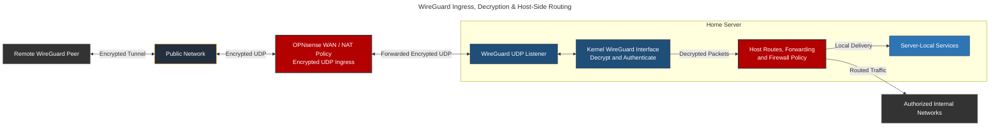
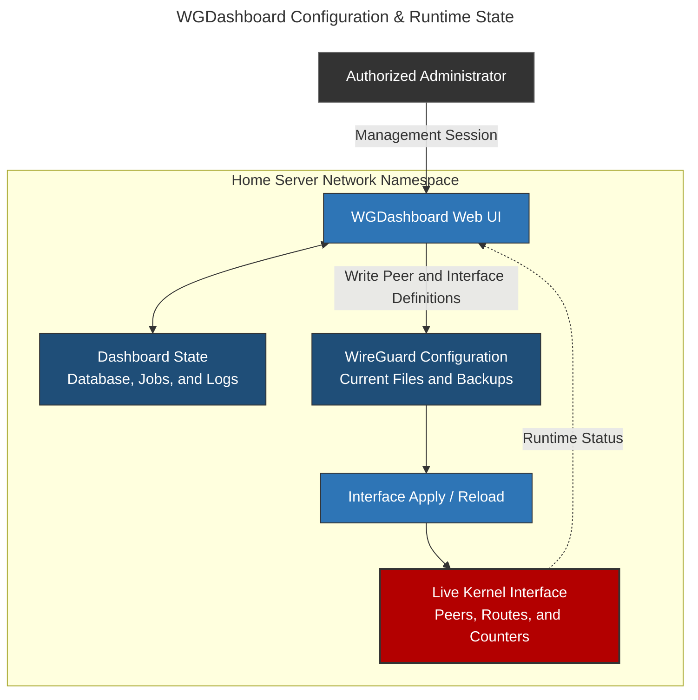

# WGDashboard: WireGuard Control Plane & Peer Management

## Overview & Purpose

WGDashboard provides a web-based control plane for managing WireGuard configurations on the home server. It assists with peer enrollment, configuration generation, status inspection, and interface lifecycle operations; the Linux WireGuard implementation remains responsible for encryption, authentication, routing decisions, and packet transport.

This distinction is operationally important:

* **WGDashboard:** Edits and applies configuration, displays peer state, and handles profile generation.
* **WireGuard kernel interface:** Implements the encrypted data plane and cryptokey routing.
* **Linux host:** Enforces local routing, forwarding, and firewall policy after decryption.
* **OPNsense:** Provides the upstream WAN/NAT boundary for encrypted UDP ingress; it is not automatically in the path of decrypted traffic delivered to services on the VPN endpoint host.

The dashboard is therefore a security-sensitive management application rather than the VPN tunnel itself.

---

## Deployment Architecture

### Encrypted Ingress and Decrypted Traffic Paths



OPNsense can filter or forward the encrypted UDP transport before it reaches the server. Once WireGuard decrypts a packet on the home server, traffic destined for that server is processed locally and does not return through OPNsense merely because OPNsense handled WAN ingress. Routed access to other networks follows the host routing table and whatever downstream path that route selects.

The direct remote-peer path shown here is distinct from the OCI public-IPv4 relay path documented in [`oracle.md`](oracle.md). Both terminate WireGuard on a homelab peer, but the OCI path first translates a selected public service on the cloud edge and returns it through an established site-to-site tunnel.

### Control Plane and Kernel State



Persistent files, dashboard records, service-manager state, and the live kernel interface are related but not identical. An out-of-band file edit, direct `wg`/`ip` command, failed reload, or container interruption can leave one layer different from another.

---

## Container Integration

### Sanitized Deployment Definition

```yaml
services:
  wgdashboard:
    image: ghcr.io/wgdashboard/wgdashboard
    restart: unless-stopped
    container_name: wgdashboard
    volumes:
      - <WIREGUARD_CONFIGURATION_PATH>:/etc/wireguard
      - <AMNEZIA_CONFIGURATION_PATH>:/etc/amnezia/amneziawg
      - <DASHBOARD_STATE_PATH>:/data
    cap_add:
      - NET_ADMIN
    network_mode: host
    healthcheck:
      test: ["CMD", "curl", "-f", "http://localhost:<WG_DASHBOARD_UI_PORT>"]
      interval: 1m
      timeout: 10s
      retries: 3
      start_period: 10s
      start_interval: 5s

```

Host networking places the dashboard and its network operations in the server's network namespace. `NET_ADMIN` consequently applies to that namespace rather than to a disposable, isolated container network. It permits operations affecting host interfaces, routes, and firewall state—not only the WireGuard interface.

The configuration mounts WireGuard definitions and dashboard state persistently. The AmneziaWG directory mount only makes a configuration location available; it does not install an Amnezia-capable kernel module or userspace implementation.

### Runtime Privilege Boundary

The combination of host networking, `NET_ADMIN`, and writable VPN configuration mounts substantially weakens container isolation. A dashboard compromise could alter host networking and steal or replace VPN key material available through the mounts.

With host networking, `NET_ADMIN`, and writable VPN configuration mounts, a compromised dashboard could alter host networking and replace tunnel credentials. Running the web process as a non-root user would limit some filesystem access, but privileged network operations would remain. Separating the web interface from a narrowly scoped configuration-apply service would reduce this exposure.

---

## WireGuard Data Plane

### Cryptokey Routing

Each peer's public key is associated with `AllowedIPs` entries. These prefixes serve two roles:

* Select the peer used for matching outbound destinations.
* Restrict which decrypted source addresses are accepted from that peer.

`AllowedIPs` is not a complete application authorization policy. Host firewall rules and service-level authentication still determine what an authenticated peer can use after tunnel admission.

### Forwarding Scope

IPv4 forwarding is enabled on the host, supporting traffic routed between the WireGuard interface and other networks. IPv6 forwarding is not enabled, so equivalent routed IPv6 behavior is not claimed.

Forwarding is required for transit traffic, not for packets delivered to a service running directly on the VPN endpoint host.

No interface-specific source NAT or TCP MSS-clamp rule was established. Neither is universally mandatory: routed networks can use explicit return routes, and path MTU discovery can work without clamping. They remain diagnostic considerations when return routing or packet sizing fails.

### MTU and Path Behavior

The host WireGuard interface uses an MTU of 1420. That is a reasonable standard starting point, not a guarantee for every WAN or cellular path. A peer can complete its handshake while larger payloads stall because handshake packets are small and data packets encounter fragmentation or broken path-MTU discovery.

MTU diagnosis should compare small and large probes, inspect route MTUs, and test TCP behavior before lowering MTU or adding MSS clamping. Blanket clamp rules can hide the actual routing problem and should not be added without evidence.

### Peer Identity and Revocation

Private keys remain on the device or server that owns them; public keys identify approved peers. Optional preshared keys add symmetric secret material. Private keys, preshared keys, public peer identifiers, endpoints, tunnel addresses, routed prefixes, QR codes, and downloadable profiles are excluded from this repository.

Revocation requires removing the peer from intended configuration and confirming removal from the live kernel interface. When a device or exported profile may be compromised, any shared secret associated with that profile must also be replaced.

---

## AmneziaWG Boundary

WGDashboard can store AmneziaWG configurations when paired with an Amnezia-capable implementation.

No AmneziaWG data plane is active on the host.

---

## Management Security

### Web UI Exposure

Host networking means Docker port publication cannot be used to infer the dashboard's exposure. The actual boundary depends on the process listen address, host firewall, reverse proxy or VPN path, and application authentication.

### Configuration and State Protection

Persisted state includes dashboard databases, job and log data, current WireGuard configuration, and dated configuration backups. These files can expose peer identities and key material, so live configuration and its backups remain outside version control and share the same access restrictions.

### Control Plane vs. Data Plane Availability

Existing WireGuard interfaces can continue forwarding independently of the dashboard process. Conversely, a healthy dashboard does not prove that a configuration was applied to the kernel. Management-plane health and tunnel data-plane health must be checked separately.

---

## Failure Modes & Resolution

### Common Failure Modes

| Failure Mode | Diagnostic Path | Resolution |
| --- | --- | --- |
| **No handshake** | Compare peer keys and endpoint configuration; verify UDP ingress, listener state, clock, and upstream NAT/firewall path | Restore the encrypted transport path or replace incorrect peer identity without exposing keys in logs |
| **Handshake succeeds but host service is unreachable** | Check server-side `AllowedIPs`, local routes, host firewall policy, and the service listen address | Correct the narrowest failing host-side rule or route; OPNsense WAN ingress does not authorize decrypted local delivery |
| **Handshake succeeds but routed network is unreachable** | Verify IPv4/IPv6 forwarding, downstream route, return route, firewall FORWARD policy, and any required NAT | Enable only the required address-family forwarding and add explicit bidirectional routing or scoped NAT |
| **Small packets work but larger transfers stall** | Compare packet sizes, interface/route MTU, ICMP handling, and TCP behavior | Correct path MTU first; reduce tunnel MTU or apply scoped MSS clamping only when measurements support it |
| **Overlapping `AllowedIPs` select the wrong peer** | Compare live peer routes and kernel routing decisions with intended prefixes | Remove ambiguity, apply the corrected configuration, and verify the live route table |
| **Dashboard differs from configuration files** | Compare dashboard records, current files, and dated backups | Establish the authoritative intended state before overwriting any layer |
| **Configuration files differ from live kernel state** | Compare `wg show`, `ip address`, and `ip route` with persisted definitions and service state | Apply or reload the intended interface safely, then verify peers and routes rather than assuming the write succeeded |
| **Dashboard unavailable while tunnels remain active** | Check the dashboard process separately from `wg show` and interface counters | Restore the management plane without unnecessarily tearing down healthy kernel interfaces |
| **Dashboard healthy but interface absent or stale** | Inspect apply/reload logs, privileges, service-manager state, and live interface state | Repair the privileged apply path and reconcile intended configuration with the kernel |
| **Unauthorized management exposure** | Inspect the actual UI listen socket, host firewall, and access path | Restrict binding or firewall scope and rotate dashboard credentials or peer material if exposure occurred |
| **Peer device is lost** | Identify its intended and live peer entries without publishing keys | Remove the peer from both configuration and kernel state; rotate preshared or copied credentials where applicable |
